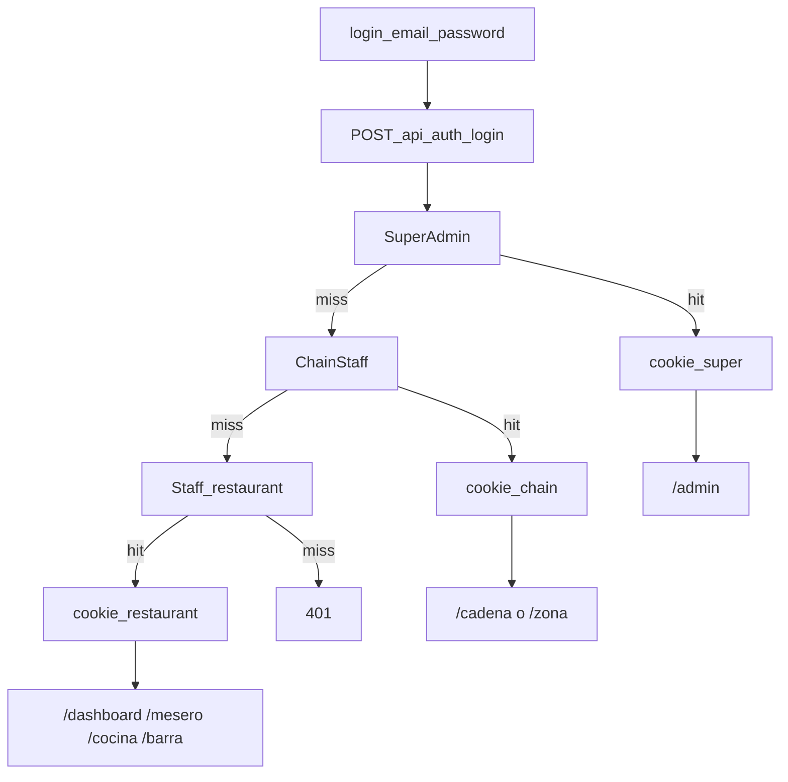

# Login único solo con correo y contraseña

## Alcance

- **Una pantalla** `/login`: correo + contraseña, sin pestañas.
- **Sin PIN** para autenticación (cadena, zona, restaurante).
- Tres familias de identidad en el mismo flujo de login:
  1. **Plataforma:** [`SuperAdmin`](prisma/schema.prisma)
  2. **Cadena / zona:** [`ChainStaff`](prisma/schema.prisma) (`CHAIN_ADMIN`, `ZONE_MANAGER`)
  3. **Restaurante:** [`Staff`](prisma/schema.prisma) con [`Role`](prisma/schema.prisma) `ADMIN` | `MESERO` | `COCINA` | `BARRA`

## Estado actual (para sustituir)

| Actor | Hoy | Objetivo |
|-------|-----|----------|
| Super admin | Cookie `bq_admin_session`, [`/api/admin/login`](src/app/api/admin/login/route.ts) | Misma ruta `/login` y cookie unificada o misma familia de claims. |
| `CHAIN_ADMIN` / `ZONE_MANAGER` | PIN + guards con `sessionStorage` | Email + contraseña; sesión con `chainId` / `zoneId` / `staffId` (ChainStaff). |
| **Restaurante** `Staff` | Solo `pin` en BD, sin login unificado; páginas usan [`getDefaultRestaurant()`](src/actions/restaurant.ts) (sucursal implícita) | Email + contraseña; sesión con **`restaurantId`** + **`Role`**; cada rol entra a **su vista**. |

### Mapa redirección post-login (por rol de restaurante)

Definición de producto para la primera versión (ajustable):

| `Staff.role` | Ruta inicial sugerida |
|--------------|-------------------------|
| `ADMIN` | `/dashboard` |
| `MESERO` | `/mesero` |
| `COCINA` | `/cocina` |
| `BARRA` | `/barra` |

Las rutas ya existen: [`src/app/dashboard/page.tsx`](src/app/dashboard/page.tsx), [`src/app/mesero/page.tsx`](src/app/mesero/page.tsx), [`src/app/cocina/page.tsx`](src/app/cocina/page.tsx), [`src/app/barra/page.tsx`](src/app/barra/page.tsx).

**Restricción:** un mesero no debería poder abrir `/cocina` por URL si la sesión no lo permite; el **middleware o layouts** deben comprobar `Role` frente al prefijo de ruta.

## Modelo de datos (Prisma)

### ChainStaff

- `email` `String @unique`, `passwordHash` `String`.
- Unicidad de **email a nivel aplicación** también frente a `SuperAdmin` y `Staff` (no pueden repetirse entre tablas).

### Staff (restaurante)

En [`Staff`](prisma/schema.prisma) hoy hay `pin`; añadir:

- `email` `String @unique`
- `passwordHash` `String`

Migración: staff sin email → script de invitación / reset obligatorio antes de login.

### Hash de contraseña

Reutilizar o extraer helpers compartidos (p. ej. desde [`super-admin-password.ts`](src/lib/super-admin-password.ts)) para **una sola política** de hash/verificación.

## API y sesión

**`POST /api/auth/login`** `{ email, password }` — orden de resolución **fijo y documentado**:

1. `SuperAdmin` por email  
2. si no, `ChainStaff` por email (`isActive`)  
3. si no, `Staff` por email (`isActive`)

Cookie firmada (HMAC, mismo patrón que [`admin-session.ts`](src/lib/admin-session.ts)) con payload discriminado, por ejemplo:

- `kind`: `super_admin` | `chain` | `restaurant` (nombres exactos a definir en código)
- Super admin: `superAdminId`
- Cadena: `staffId` (ChainStaff), `chainRole`, `chainId`, `zoneId?`
- Restaurante: `staffId` (Staff), `restaurantRole` (mapeo desde `Role`), `restaurantId`

**Logout:** limpiar cookie(s).

**Helpers:** `getSession()`, `requireRestaurantStaff()`, `requireChainOperator()`, etc., para server actions y layouts.

**Middleware:** extender matcher además de `/admin` hacia `/cadena`, `/zona`, `/dashboard`, `/mesero`, `/cocina`, `/barra` — cookie válida y, donde aplique, **rol permitido para esa ruta**.

## Contexto por restaurante (cambio importante)

Hoy [`getDefaultRestaurant()`](src/actions/restaurant.ts) y flujos tipo [`getLiveOrders()`](src/actions/orders.ts) asumen **una** sucursal por entorno. Con login de `Staff` hay que:

- Filtrar **siempre** por `restaurantId` de la sesión del usuario autenticado.
- Eliminar o relegar el modo “default único” salvo para seeds/desarrollo.

Esto afecta KDS ([`cocina/page.tsx`](src/app/cocina/page.tsx), [`barra/page.tsx`](src/app/barra/page.tsx)), mesero y dashboard.

## Página `/login`

- Formulario único → `POST /api/auth/login` → `router.push` al **default por rol** o a `next` si [`safe-redirect`](src/lib/safe-redirect.ts) lo autoriza.
- Lista blanca de prefijos en `next`: `/admin`, `/cadena`, `/zona`, `/dashboard`, `/mesero`, `/cocina`, `/barra`, etc.

## Guards y PIN

- Sustituir PIN en [`ChainAuthGuard`](src/components/chain/ChainAuthGuard.tsx) / [`ZoneAuthGuard`](src/components/chain/ZoneAuthGuard.tsx).
- Añadir protección equivalente en rutas de **restaurante** (no solo “hay cookie”, sino **rol vs ruta**).
- Quitar uso de auth vía `sessionStorage` para estos flujos.

## Acciones legacy

- `verifyChainPin` / `verifyZonePin`: fuera del login; operaciones sensibles usan identidad de sesión.
- Flujos de **alta de personal** (cadena y restaurante): capturar email + contraseña (o invitación con set password).
- **Zona:** sustituir rotación de PIN por **cambio de contraseña** donde aplique.

## Diagrama de flujo (resumido)

## Orden de implementación sugerido

1. Prisma: `ChainStaff` + `Staff` (email, passwordHash) + migraciones.
2. Librería de sesión unificada + `/api/auth/login` + logout.
3. `/login` + redirecciones por rol (incl. restaurante).
4. Contexto `restaurantId` en server actions (reemplazo de default implícito).
5. Middleware / layouts por rol en rutas de restaurante.
6. Limpieza guards PIN y enlaces `/admin/login` → `/login`.

## Depende explícitamente de este plan

- Invitar / crear usuarios restaurante con email en UI (staff roster por restaurante), alineado con el modelo nuevo.
