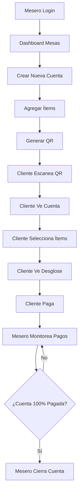

# Bouquet - Sistema de Gestión de Cuentas para Restaurantes

## 1. Product Overview

Bouquet es una plataforma digital que permite a los restaurantes gestionar cuentas de mesa de forma eficiente, facilitando el pago dividido entre comensales mediante códigos QR.

El sistema resuelve el problema de dividir cuentas en restaurantes, permitiendo que cada cliente pague únicamente por lo que consumió a través de una interfaz móvil intuitiva, mientras el personal del restaurante mantiene control total sobre las mesas y transacciones.

Objetivo: Digitalizar y optimizar el proceso de pago en restaurantes, mejorando la experiencia del cliente y la eficiencia operativa del establecimiento.

## 2. Core Features

### 2.1 User Roles

| Role | Registration Method | Core Permissions |
|------|---------------------|------------------|
| Mesero (Staff) | Login con PIN o credenciales simples | Crear/administrar mesas, agregar ítems, generar QR, monitorear pagos, cerrar cuentas |
| Cliente (Comensal) | Acceso directo vía QR (sin registro) | Ver cuenta de mesa, seleccionar ítems consumidos, realizar pago individual |
| Administrador | Credenciales de administrador | Ver métricas globales, configurar parámetros del sistema (IVA, propina) |

### 2.2 Feature Module

Nuestro sistema de gestión de cuentas consta de las siguientes páginas principales:

1. **Vista Mesero (Web)**: login staff, dashboard de mesas, gestión de cuentas, generación de QR, monitoreo de pagos.
2. **Vista Cliente (PWA móvil)**: pantalla de bienvenida, detalle de cuenta, selección de ítems, checkout y confirmación.
3. **Panel Administrador**: métricas globales, configuración de parámetros del sistema.

### 2.3 Page Details

| Page Name | Module Name | Feature description |
|-----------|-------------|---------------------|
| Vista Mesero | Login Staff | Autenticación simple con PIN o credenciales básicas |
| Vista Mesero | Dashboard Mesas | Visualizar lista de mesas abiertas con estado de ocupación y progreso de pago |
| Vista Mesero | Crear Nueva Cuenta | Inicializar cuenta de mesa con número de mesa y datos básicos |
| Vista Mesero | Detalle Mesa | Agregar ítems (nombre, precio, cantidad, notas), generar código QR, ver estado de pagos individuales |
| Vista Mesero | Gestión de Ítems | Añadir, editar y eliminar productos de la cuenta con precios y cantidades |
| Vista Mesero | Monitoreo Pagos | Visualizar qué clientes han pagado y porcentaje de cuenta liquidada |
| Vista Mesero | Cerrar Cuenta | Finalizar cuenta cuando todos los pagos están completados |
| Vista Cliente | Pantalla Bienvenida | Mostrar logo del restaurante y datos básicos de la mesa al escanear QR |
| Vista Cliente | Detalle Cuenta | Listar todos los ítems de la mesa con checkboxes para selección individual |
| Vista Cliente | Barra Resumen | Calcular y mostrar subtotal, IVA, propina sugerida y total a pagar |
| Vista Cliente | Checkout | Integración con métodos de pago (Stripe/MercadoPago) para procesamiento de tarjetas |
| Vista Cliente | Confirmación | Mostrar recibo digital y confirmación de pago exitoso |
| Panel Administrador | Métricas Globales | Dashboard con estadísticas de uso, conversiones y errores del sistema |
| Panel Administrador | Configuración | Ajustar parámetros como porcentaje de IVA y propina por defecto |

## 3. Core Process

**Flujo Mesero:**
El mesero inicia sesión en el sistema web, crea una nueva cuenta de mesa, agrega los ítems consumidos con sus respectivos precios, genera un código QR único para la mesa, monitorea en tiempo real qué clientes van pagando sus partes individuales, y finalmente cierra la cuenta cuando el 100% está liquidado.

**Flujo Cliente:**
El cliente escanea el código QR de su mesa, ve la lista completa de ítems consumidos, selecciona únicamente los productos que él consumió, revisa el desglose de costos (subtotal, IVA, propina), procede al pago con tarjeta a través de la pasarela integrada, y recibe confirmación digital de su transacción.

## 4. User Interface Design

### 4.1 Design Style

- **Colores primarios**: Azul corporativo (#2563EB) y verde éxito (#10B981)
- **Colores secundarios**: Gris neutro (#6B7280) y blanco (#FFFFFF)
- **Estilo de botones**: Redondeados con sombras suaves, estilo moderno
- **Tipografía**: Inter o similar, tamaños 14px-18px para texto principal, 24px+ para títulos
- **Layout**: Diseño tipo tarjeta con navegación superior, espaciado generoso
- **Iconos**: Estilo outline minimalista, emojis para categorías de comida

### 4.2 Page Design Overview

| Page Name | Module Name | UI Elements |
|-----------|-------------|-------------|
| Vista Mesero | Dashboard | Grid de tarjetas de mesas, indicadores de estado con colores, botón flotante "Nueva Mesa" |
| Vista Mesero | Detalle Mesa | Lista vertical de ítems, botón prominente "Generar QR", barra de progreso de pagos |
| Vista Cliente | Bienvenida | Logo centrado, nombre de mesa destacado, botón CTA "Ver Mi Cuenta" |
| Vista Cliente | Detalle Cuenta | Lista con checkboxes, precios alineados a la derecha, barra fija inferior con totales |
| Vista Cliente | Checkout | Formulario de pago limpio, logos de métodos de pago, botón de confirmación destacado |

### 4.3 Responsiveness

El sistema es mobile-first con adaptación completa a desktop. La vista del mesero está optimizada para tablets y computadoras, mientras que la vista del cliente está diseñada específicamente para dispositivos móviles con interacciones táctiles optimizadas y navegación por gestos.