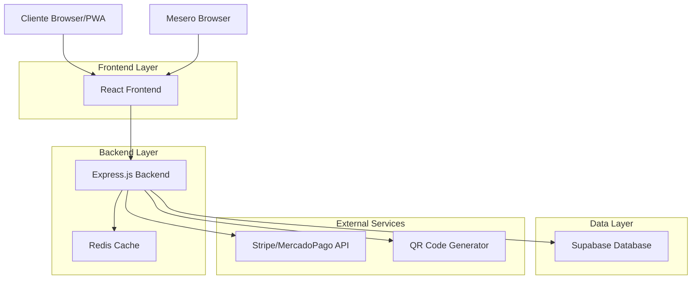
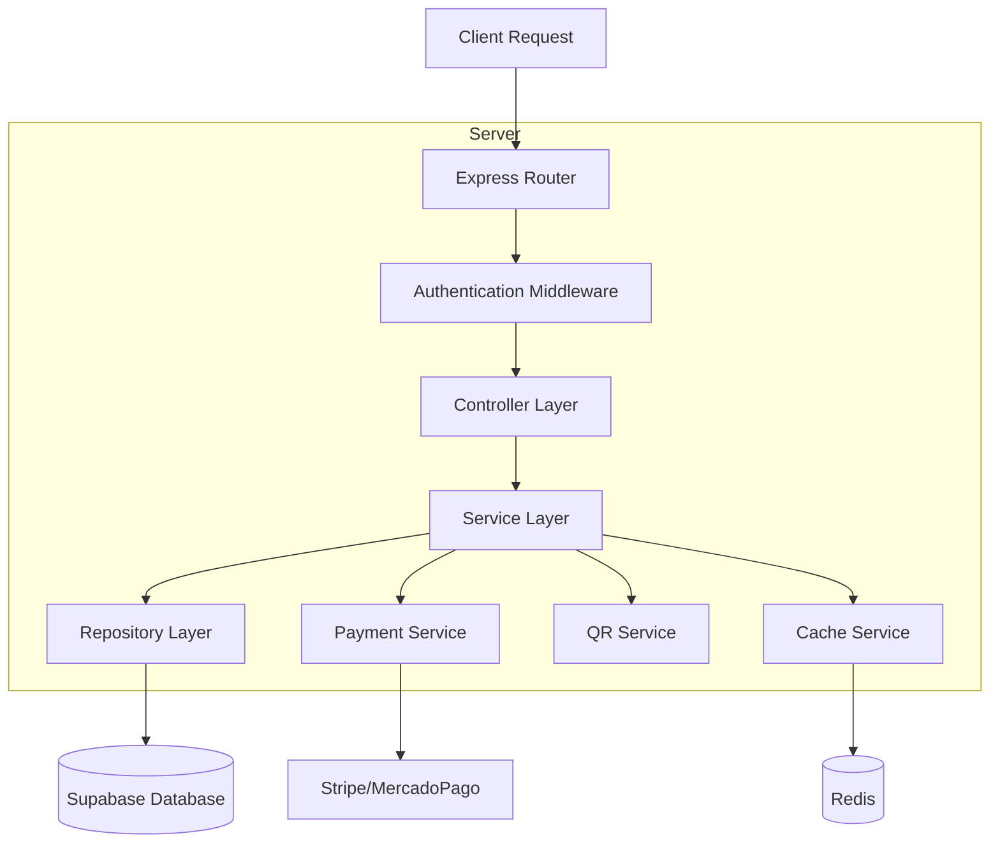
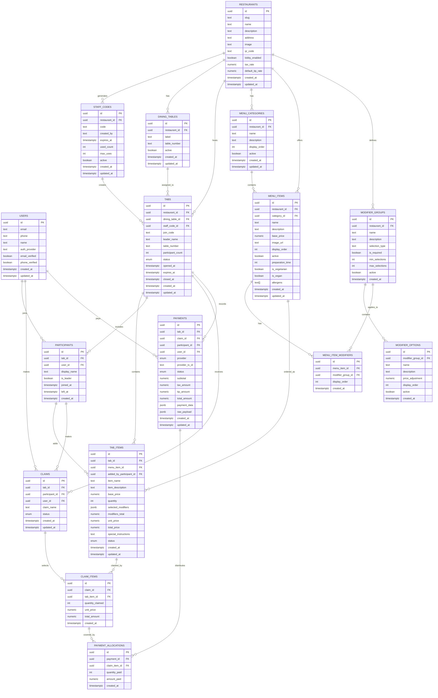

# Bouquet - Arquitectura Técnica

## 1. Architecture design



## 2. Technology Description

* **Frontend**: React\@18 + TypeScript + TailwindCSS\@3 + Vite

* **Backend**: Express.js\@4 + TypeScript + Node.js

* **Database**: Supabase (PostgreSQL)

* **Cache**: Redis

* **Payment**: Stripe + MercadoPago APIs

* **QR Generation**: qrcode library

* **Authentication**: Supabase Auth

## 3. Route definitions

| Route                 | Purpose                              |
| --------------------- | ------------------------------------ |
| /                     | Landing page y redirección           |
| /staff/login          | Login para meseros                   |
| /staff/dashboard      | Dashboard principal de mesas         |
| /staff/table/:id      | Detalle y gestión de mesa específica |
| /table/:qrId          | Vista cliente - acceso vía QR        |
| /table/:qrId/checkout | Proceso de pago del cliente          |
| /table/:qrId/receipt  | Confirmación y recibo                |
| /admin/dashboard      | Panel de administración              |
| /admin/settings       | Configuración del sistema            |

## 4. API definitions

### 4.1 Core API

**Autenticación de Staff**

```
POST /api/auth/staff/login
```

Request:

| Param Name   | Param Type | isRequired | Description        |
| ------------ | ---------- | ---------- | ------------------ |
| pin          | string     | true       | PIN del mesero     |
| restaurantId | string     | true       | ID del restaurante |

Response:

| Param Name | Param Type | Description                |
| ---------- | ---------- | -------------------------- |
| success    | boolean    | Estado de la autenticación |
| token      | string     | JWT token para sesión      |
| user       | object     | Datos del mesero           |

**Autenticación de Usuario (Cliente)**

```
POST /api/auth/user/register
```

Request:

| Param Name    | Param Type | isRequired | Description           |
| ------------- | ---------- | ---------- | --------------------- |
| email         | string     | true       | Email del usuario     |
| name          | string     | true       | Nombre completo       |
| authProvider  | string     | false      | email/google/facebook |

Response:

| Param Name | Param Type | Description                |
| ---------- | ---------- | -------------------------- |
| success    | boolean    | Estado del registro        |
| user       | object     | Datos del usuario creado   |
| token      | string     | JWT token para sesión      |

**Gestión de Mesas**

```
POST /api/tables
```

Request:

| Param Name  | Param Type | isRequired | Description    |
| ----------- | ---------- | ---------- | -------------- |
| tableNumber | number     | true       | Número de mesa |
| staffId     | string     | true       | ID del mesero  |

Response:

| Param Name | Param Type | Description                 |
| ---------- | ---------- | --------------------------- |
| tableId    | string     | ID único de la mesa         |
| qrCode     | string     | Código QR generado          |
| qrUrl      | string     | URL para acceso del cliente |

**Gestión de Ítems del Menú**

```
GET /api/restaurants/:restaurantId/menu
```

Response:

| Param Name | Param Type | Description                    |
| ---------- | ---------- | ------------------------------ |
| categories | array      | Categorías del menú            |
| items      | array      | Ítems base con modificadores   |
| modifiers  | array      | Grupos y opciones de modificadores |

**Agregar Ítem a Mesa**

```
POST /api/tables/:tableId/items
```

Request:

| Param Name         | Param Type | isRequired | Description                    |
| ------------------ | ---------- | ---------- | ------------------------------ |
| menuItemId         | string     | true       | ID del ítem base del menú      |
| participantId      | string     | true       | ID del participante autenticado|
| quantity           | number     | true       | Cantidad                       |
| selectedModifiers  | array      | false      | Modificadores seleccionados    |
| specialInstructions| string     | false      | Notas especiales del cliente   |

**Proceso de Pago**

```
POST /api/payments/process
```

Request:

| Param Name    | Param Type | isRequired | Description                        |
| ------------- | ---------- | ---------- | ---------------------------------- |
| tableId       | string     | true       | ID de la mesa                      |
| selectedItems | array      | true       | Ítems seleccionados por el cliente |
| paymentMethod | string     | true       | stripe o mercadopago               |
| paymentData   | object     | true       | Datos de la tarjeta                |

Response:

| Param Name    | Param Type | Description          |
| ------------- | ---------- | -------------------- |
| success       | boolean    | Estado del pago      |
| transactionId | string     | ID de la transacción |
| receipt       | object     | Datos del recibo     |

## 5. Server architecture diagram



## 6. Data model

### 6.1 Data model definition



### 6.2 Data Definition Language

**Users Table**

```sql
CREATE TABLE users (
    id UUID PRIMARY KEY DEFAULT gen_random_uuid(),
    email VARCHAR(255) UNIQUE NOT NULL,
    phone VARCHAR(20),
    name VARCHAR(255) NOT NULL,
    auth_provider VARCHAR(50) DEFAULT 'email',
    email_verified BOOLEAN DEFAULT false,
    phone_verified BOOLEAN DEFAULT false,
    created_at TIMESTAMP WITH TIME ZONE DEFAULT NOW(),
    updated_at TIMESTAMP WITH TIME ZONE DEFAULT NOW()
);

CREATE INDEX idx_users_email ON users(email);
CREATE INDEX idx_users_phone ON users(phone);
CREATE INDEX idx_users_auth_provider ON users(auth_provider);

GRANT SELECT ON users TO anon;
GRANT ALL PRIVILEGES ON users TO authenticated;
```

**Restaurants Table**

```sql
CREATE TABLE restaurants (
    id UUID PRIMARY KEY DEFAULT gen_random_uuid(),
    slug VARCHAR(100) UNIQUE NOT NULL,
    name VARCHAR(255) NOT NULL,
    description TEXT,
    address TEXT,
    image TEXT,
    qr_code TEXT,
    lobby_enabled BOOLEAN DEFAULT true,
    tax_rate DECIMAL(5,4) DEFAULT 0.16,
    default_tip_rate DECIMAL(5,4) DEFAULT 0.10,
    created_at TIMESTAMP WITH TIME ZONE DEFAULT NOW(),
    updated_at TIMESTAMP WITH TIME ZONE DEFAULT NOW()
);

CREATE INDEX idx_restaurants_slug ON restaurants(slug);
CREATE INDEX idx_restaurants_lobby_enabled ON restaurants(lobby_enabled);

GRANT SELECT ON restaurants TO anon;
GRANT ALL PRIVILEGES ON restaurants TO authenticated;
```

**Menu Categories Table**

```sql
CREATE TABLE menu_categories (
    id UUID PRIMARY KEY DEFAULT gen_random_uuid(),
    restaurant_id UUID NOT NULL REFERENCES restaurants(id) ON DELETE CASCADE,
    name VARCHAR(255) NOT NULL,
    description TEXT,
    display_order INTEGER DEFAULT 0,
    active BOOLEAN DEFAULT true,
    created_at TIMESTAMP WITH TIME ZONE DEFAULT NOW(),
    updated_at TIMESTAMP WITH TIME ZONE DEFAULT NOW()
);

CREATE INDEX idx_menu_categories_restaurant ON menu_categories(restaurant_id, active, display_order);

GRANT SELECT ON menu_categories TO anon;
GRANT ALL PRIVILEGES ON menu_categories TO authenticated;
```

**Menu Items Table**

```sql
CREATE TABLE menu_items (
    id UUID PRIMARY KEY DEFAULT gen_random_uuid(),
    restaurant_id UUID NOT NULL REFERENCES restaurants(id) ON DELETE CASCADE,
    category_id UUID REFERENCES menu_categories(id) ON DELETE SET NULL,
    name VARCHAR(255) NOT NULL,
    description TEXT,
    base_price DECIMAL(10,2) NOT NULL CHECK (base_price >= 0),
    image_url TEXT,
    display_order INTEGER DEFAULT 0,
    active BOOLEAN DEFAULT true,
    -- Metadatos útiles
    preparation_time INTEGER, -- minutos estimados
    is_vegetarian BOOLEAN DEFAULT false,
    is_vegan BOOLEAN DEFAULT false,
    allergens TEXT[], -- array de alérgenos
    created_at TIMESTAMP WITH TIME ZONE DEFAULT NOW(),
    updated_at TIMESTAMP WITH TIME ZONE DEFAULT NOW()
);

CREATE INDEX idx_menu_items_restaurant ON menu_items(restaurant_id, active);
CREATE INDEX idx_menu_items_category ON menu_items(category_id, active, display_order);
CREATE INDEX idx_menu_items_dietary ON menu_items(is_vegetarian, is_vegan);

GRANT SELECT ON menu_items TO anon;
GRANT ALL PRIVILEGES ON menu_items TO authenticated;
```

**Modifier Groups Table**

```sql
CREATE TABLE modifier_groups (
    id UUID PRIMARY KEY DEFAULT gen_random_uuid(),
    restaurant_id UUID NOT NULL REFERENCES restaurants(id) ON DELETE CASCADE,
    name VARCHAR(255) NOT NULL, -- ej: "Tamaño", "Cocción", "Extras"
    description TEXT,
    selection_type VARCHAR(20) CHECK (selection_type IN ('single', 'multiple')) DEFAULT 'single',
    is_required BOOLEAN DEFAULT false,
    min_selections INTEGER DEFAULT 0,
    max_selections INTEGER,
    active BOOLEAN DEFAULT true,
    created_at TIMESTAMP WITH TIME ZONE DEFAULT NOW()
);

CREATE INDEX idx_modifier_groups_restaurant ON modifier_groups(restaurant_id, active);

GRANT SELECT ON modifier_groups TO anon;
GRANT ALL PRIVILEGES ON modifier_groups TO authenticated;
```

**Modifier Options Table**

```sql
CREATE TABLE modifier_options (
    id UUID PRIMARY KEY DEFAULT gen_random_uuid(),
    modifier_group_id UUID NOT NULL REFERENCES modifier_groups(id) ON DELETE CASCADE,
    name VARCHAR(255) NOT NULL, -- ej: "Grande", "Término medio", "Queso extra"
    description TEXT,
    price_adjustment DECIMAL(10,2) DEFAULT 0, -- precio adicional/descuento
    display_order INTEGER DEFAULT 0,
    active BOOLEAN DEFAULT true,
    created_at TIMESTAMP WITH TIME ZONE DEFAULT NOW()
);

CREATE INDEX idx_modifier_options_group ON modifier_options(modifier_group_id, active, display_order);

-- Constraint para ajustes de precio razonables
ALTER TABLE modifier_options 
ADD CONSTRAINT check_reasonable_price_adjustment 
CHECK (price_adjustment >= -999.99 AND price_adjustment <= 999.99);

GRANT SELECT ON modifier_options TO anon;
GRANT ALL PRIVILEGES ON modifier_options TO authenticated;
```

**Menu Item Modifiers Table**

```sql
CREATE TABLE menu_item_modifiers (
    id UUID PRIMARY KEY DEFAULT gen_random_uuid(),
    menu_item_id UUID NOT NULL REFERENCES menu_items(id) ON DELETE CASCADE,
    modifier_group_id UUID NOT NULL REFERENCES modifier_groups(id) ON DELETE CASCADE,
    display_order INTEGER DEFAULT 0,
    created_at TIMESTAMP WITH TIME ZONE DEFAULT NOW(),
    
    UNIQUE(menu_item_id, modifier_group_id)
);

CREATE INDEX idx_menu_item_modifiers_item ON menu_item_modifiers(menu_item_id);
CREATE INDEX idx_menu_item_modifiers_group ON menu_item_modifiers(modifier_group_id);

GRANT SELECT ON menu_item_modifiers TO anon;
GRANT ALL PRIVILEGES ON menu_item_modifiers TO authenticated;
```

**Staff Codes Table**

```sql
CREATE TABLE staff_codes (
    id UUID PRIMARY KEY DEFAULT gen_random_uuid(),
    restaurant_id UUID NOT NULL REFERENCES restaurants(id) ON DELETE CASCADE,
    code VARCHAR(10) NOT NULL,
    created_by VARCHAR(255) NOT NULL,
    expires_at TIMESTAMP WITH TIME ZONE NOT NULL,
    used_count INTEGER DEFAULT 0,
    max_uses INTEGER DEFAULT 10,
    active BOOLEAN DEFAULT true,
    created_at TIMESTAMP WITH TIME ZONE DEFAULT NOW(),
    updated_at TIMESTAMP WITH TIME ZONE DEFAULT NOW()
);

CREATE INDEX idx_staff_codes_restaurant_id ON staff_codes(restaurant_id);
CREATE INDEX idx_staff_codes_code ON staff_codes(code);
CREATE INDEX idx_staff_codes_active ON staff_codes(active);
CREATE INDEX idx_staff_codes_expires_at ON staff_codes(expires_at);

GRANT SELECT ON staff_codes TO anon;
GRANT ALL PRIVILEGES ON staff_codes TO authenticated;
```

**Dining Tables Table**

```sql
CREATE TABLE dining_tables (
    id UUID PRIMARY KEY DEFAULT gen_random_uuid(),
    restaurant_id UUID NOT NULL REFERENCES restaurants(id) ON DELETE CASCADE,
    label VARCHAR(255) NOT NULL,
    table_number VARCHAR(50),
    active BOOLEAN DEFAULT true,
    created_at TIMESTAMP WITH TIME ZONE DEFAULT NOW(),
    updated_at TIMESTAMP WITH TIME ZONE DEFAULT NOW()
);

CREATE INDEX idx_dining_tables_restaurant_id ON dining_tables(restaurant_id);
CREATE INDEX idx_dining_tables_active ON dining_tables(active);

GRANT SELECT ON dining_tables TO anon;
GRANT ALL PRIVILEGES ON dining_tables TO authenticated;
```

**Tab Status Enum**

```sql
CREATE TYPE tab_status AS ENUM (
    'waiting_customers',  -- Mesa creada, esperando clientes
    'active',            -- Clientes conectados
    'partial_payment',   -- Algunos pagos hechos
    'fully_paid',        -- Todo pagado
    'closed',            -- Mesa cerrada
    'abandoned'          -- Sin actividad
);
```

**Tabs Table**

```sql
CREATE TABLE tabs (
    id UUID PRIMARY KEY DEFAULT gen_random_uuid(),
    restaurant_id UUID NOT NULL REFERENCES restaurants(id) ON DELETE CASCADE,
    dining_table_id UUID REFERENCES dining_tables(id),
    staff_code_id UUID REFERENCES staff_codes(id),
    join_code VARCHAR(6) UNIQUE NOT NULL,
    leader_name VARCHAR(255) NOT NULL,
    table_number VARCHAR(50),
    participant_count INTEGER DEFAULT 1,
    status tab_status DEFAULT 'waiting_customers',
    opened_at TIMESTAMP WITH TIME ZONE DEFAULT NOW(),
    expires_at TIMESTAMP WITH TIME ZONE DEFAULT (NOW() + INTERVAL '4 hours'),
    closed_at TIMESTAMP WITH TIME ZONE,
    created_at TIMESTAMP WITH TIME ZONE DEFAULT NOW(),
    updated_at TIMESTAMP WITH TIME ZONE DEFAULT NOW()
);

CREATE INDEX idx_tabs_restaurant_id ON tabs(restaurant_id);
CREATE INDEX idx_tabs_join_code ON tabs(join_code);
CREATE INDEX idx_tabs_status ON tabs(status);
CREATE INDEX idx_tabs_expires_at ON tabs(expires_at);
-- Índice compuesto para búsquedas por QR
CREATE INDEX idx_tabs_join_code_status ON tabs(join_code, status);

GRANT SELECT, INSERT ON tabs TO anon;
GRANT ALL PRIVILEGES ON tabs TO authenticated;
```

**Participants Table**

```sql
CREATE TABLE participants (
    id UUID PRIMARY KEY DEFAULT gen_random_uuid(),
    tab_id UUID NOT NULL REFERENCES tabs(id) ON DELETE CASCADE,
    user_id UUID NOT NULL REFERENCES users(id) ON DELETE CASCADE,
    display_name VARCHAR(255) NOT NULL,
    is_leader BOOLEAN DEFAULT false,
    joined_at TIMESTAMP WITH TIME ZONE DEFAULT NOW(),
    left_at TIMESTAMP WITH TIME ZONE,
    created_at TIMESTAMP WITH TIME ZONE DEFAULT NOW()
);

CREATE INDEX idx_participants_tab_id ON participants(tab_id);
CREATE INDEX idx_participants_user_id ON participants(user_id);
CREATE INDEX idx_participants_is_leader ON participants(is_leader);

GRANT SELECT, INSERT ON participants TO anon;
GRANT ALL PRIVILEGES ON participants TO authenticated;
```

**Tab Items Table**

```sql
CREATE TABLE tab_items (
    id UUID PRIMARY KEY DEFAULT gen_random_uuid(),
    tab_id UUID NOT NULL REFERENCES tabs(id) ON DELETE CASCADE,
    menu_item_id UUID REFERENCES menu_items(id),
    added_by_participant_id UUID REFERENCES participants(id),
    
    -- Datos del momento del pedido (para histórico)
    item_name VARCHAR(255) NOT NULL,
    item_description TEXT,
    base_price DECIMAL(10,2) NOT NULL,
    quantity INTEGER NOT NULL DEFAULT 1 CHECK (quantity > 0),
    
    -- Modificadores seleccionados (JSON para flexibilidad)
    selected_modifiers JSONB DEFAULT '[]'::jsonb,
    -- Ejemplo: [{"group_id": "uuid", "group_name": "Tamaño", "option_id": "uuid", "option_name": "Grande", "price_adjustment": 2.50}]
    
    -- Cálculos
    modifiers_total DECIMAL(10,2) DEFAULT 0,
    unit_price DECIMAL(10,2) NOT NULL, -- base_price + modifiers_total
    total_price DECIMAL(10,2) NOT NULL, -- unit_price * quantity
    
    -- Notas especiales del cliente
    special_instructions TEXT,
    
    status VARCHAR(20) DEFAULT 'active' CHECK (status IN ('active', 'canceled', 'refunded')),
    created_at TIMESTAMP WITH TIME ZONE DEFAULT NOW(),
    updated_at TIMESTAMP WITH TIME ZONE DEFAULT NOW()
);

CREATE INDEX idx_tab_items_tab_id ON tab_items(tab_id, status);
CREATE INDEX idx_tab_items_menu_item ON tab_items(menu_item_id);
CREATE INDEX idx_tab_items_participant_id ON tab_items(added_by_participant_id);
CREATE INDEX idx_tab_items_status ON tab_items(status);

-- Constraints para validaciones de integridad
ALTER TABLE tab_items 
ADD CONSTRAINT check_positive_prices 
CHECK (base_price >= 0 AND unit_price >= 0 AND total_price >= 0);

ALTER TABLE tab_items 
ADD CONSTRAINT check_positive_modifiers_total 
CHECK (modifiers_total >= -999.99); -- Permite descuentos pero con límite

ALTER TABLE tab_items 
ADD CONSTRAINT check_price_calculation 
CHECK (unit_price = base_price + modifiers_total);

ALTER TABLE tab_items 
ADD CONSTRAINT check_total_calculation 
CHECK (total_price = unit_price * quantity);

GRANT SELECT, INSERT ON tab_items TO anon;
GRANT ALL PRIVILEGES ON tab_items TO authenticated;
```

**Claims Table**

```sql
CREATE TABLE claims (
    id UUID PRIMARY KEY DEFAULT gen_random_uuid(),
    tab_id UUID NOT NULL REFERENCES tabs(id) ON DELETE CASCADE,
    participant_id UUID NOT NULL REFERENCES participants(id) ON DELETE CASCADE,
    claim_name VARCHAR(255),
    status VARCHAR(20) DEFAULT 'pending' CHECK (status IN ('pending', 'confirmed', 'paid')),
    created_at TIMESTAMP WITH TIME ZONE DEFAULT NOW(),
    updated_at TIMESTAMP WITH TIME ZONE DEFAULT NOW()
);

CREATE INDEX idx_claims_tab_id ON claims(tab_id);
CREATE INDEX idx_claims_participant_id ON claims(participant_id);
CREATE INDEX idx_claims_status ON claims(status);

GRANT SELECT, INSERT ON claims TO anon;
GRANT ALL PRIVILEGES ON claims TO authenticated;
```

**Claim Items Table**

```sql
CREATE TABLE claim_items (
    id UUID PRIMARY KEY DEFAULT gen_random_uuid(),
    claim_id UUID NOT NULL REFERENCES claims(id) ON DELETE CASCADE,
    tab_item_id UUID NOT NULL REFERENCES tab_items(id) ON DELETE CASCADE,
    quantity_claimed INTEGER NOT NULL,
    unit_price DECIMAL(10,2) NOT NULL,
    total_amount DECIMAL(10,2) NOT NULL,
    created_at TIMESTAMP WITH TIME ZONE DEFAULT NOW()
);

CREATE INDEX idx_claim_items_claim_id ON claim_items(claim_id);
CREATE INDEX idx_claim_items_tab_item_id ON claim_items(tab_item_id);

GRANT SELECT, INSERT ON claim_items TO anon;
GRANT ALL PRIVILEGES ON claim_items TO authenticated;
```

**Payments Table**

```sql
CREATE TABLE payments (
    id UUID PRIMARY KEY DEFAULT gen_random_uuid(),
    tab_id UUID NOT NULL REFERENCES tabs(id) ON DELETE CASCADE,
    claim_id UUID REFERENCES claims(id),
    participant_id UUID NOT NULL REFERENCES participants(id),
    provider VARCHAR(50) NOT NULL CHECK (provider IN ('stripe', 'mercadopago', 'cash')),
    provider_tx_id VARCHAR(255),
    status VARCHAR(20) DEFAULT 'pending' CHECK (status IN ('pending', 'processing', 'completed', 'failed', 'refunded')),
    subtotal DECIMAL(10,2) NOT NULL,
    tax_amount DECIMAL(10,2) DEFAULT 0,
    tip_amount DECIMAL(10,2) DEFAULT 0,
    total_amount DECIMAL(10,2) NOT NULL,
    payment_data JSONB,
    raw_payload JSONB,
    created_at TIMESTAMP WITH TIME ZONE DEFAULT NOW(),
    updated_at TIMESTAMP WITH TIME ZONE DEFAULT NOW()
);

CREATE INDEX idx_payments_tab_id ON payments(tab_id);
CREATE INDEX idx_payments_claim_id ON payments(claim_id);
CREATE INDEX idx_payments_participant_id ON payments(participant_id);
CREATE INDEX idx_payments_provider_tx_id ON payments(provider_tx_id);
CREATE INDEX idx_payments_status ON payments(status);
-- Índice compuesto para reportes de ventas
CREATE INDEX idx_payments_created_at_status ON payments(created_at, status);
CREATE INDEX idx_payments_restaurant_date ON payments(tab_id, created_at) WHERE status = 'completed';

GRANT SELECT, INSERT ON payments TO anon;
GRANT ALL PRIVILEGES ON payments TO authenticated;
```

**Payment Allocations Table**

```sql
CREATE TABLE payment_allocations (
    id UUID PRIMARY KEY DEFAULT gen_random_uuid(),
    payment_id UUID NOT NULL REFERENCES payments(id) ON DELETE CASCADE,
    claim_item_id UUID NOT NULL REFERENCES claim_items(id) ON DELETE CASCADE,
    quantity_paid INTEGER NOT NULL,
    amount_paid DECIMAL(10,2) NOT NULL,
    created_at TIMESTAMP WITH TIME ZONE DEFAULT NOW()
);

CREATE INDEX idx_payment_allocations_payment_id ON payment_allocations(payment_id);
CREATE INDEX idx_payment_allocations_claim_item_id ON payment_allocations(claim_item_id);

GRANT SELECT, INSERT ON payment_allocations TO anon;
GRANT ALL PRIVILEGES ON payment_allocations TO authenticated;
```

### 6.3 Auxiliary Functions

**Update Timestamp Function**

```sql
CREATE OR REPLACE FUNCTION update_updated_at_column()
RETURNS TRIGGER AS $$
BEGIN
  NEW.updated_at = NOW();
  RETURN NEW;
END;
$$ language 'plpgsql';
```

**Generate Unique Join Code Function**

```sql
CREATE OR REPLACE FUNCTION generate_unique_join_code()
RETURNS VARCHAR(6) AS $$
DECLARE
  new_code VARCHAR(6);
  code_exists BOOLEAN;
BEGIN
  LOOP
    new_code := UPPER(SUBSTRING(MD5(RANDOM()::TEXT) FROM 1 FOR 6));
    SELECT EXISTS(SELECT 1 FROM tabs WHERE join_code = new_code AND status = 'active') INTO code_exists;
    IF NOT code_exists THEN
      EXIT;
    END IF;
  END LOOP;
  RETURN new_code;
END;
$$ LANGUAGE plpgsql;
```

**Cleanup Expired Tabs Function**

```sql
CREATE OR REPLACE FUNCTION cleanup_expired_tabs()
RETURNS void AS $$
BEGIN
  UPDATE tabs 
  SET status = 'abandoned',
      updated_at = NOW()
  WHERE expires_at < NOW() 
    AND status IN ('waiting_customers', 'active', 'partial_payment');
END;
$$ LANGUAGE plpgsql;
```

**Calculate Claim Total Function**

```sql
CREATE OR REPLACE FUNCTION calculate_claim_total(p_claim_id UUID)
RETURNS DECIMAL(10,2) AS $$
DECLARE
  total_amount DECIMAL(10,2);
BEGIN
  SELECT COALESCE(SUM(total_amount), 0) INTO total_amount
  FROM claim_items
  WHERE claim_id = p_claim_id;
  
  RETURN total_amount;
END;
$$ LANGUAGE plpgsql;
```

**Calculate Tab Item Prices Function**

```sql
CREATE OR REPLACE FUNCTION calculate_tab_item_prices()
RETURNS TRIGGER AS $$
DECLARE
  modifier_total DECIMAL(10,2) := 0;
  modifier_item JSONB;
BEGIN
  -- Calcular el total de modificadores desde el JSON
  FOR modifier_item IN SELECT jsonb_array_elements(NEW.selected_modifiers)
  LOOP
    modifier_total := modifier_total + COALESCE((modifier_item->>'price_adjustment')::DECIMAL(10,2), 0);
  END LOOP;
  
  -- Actualizar los campos calculados
  NEW.modifiers_total := modifier_total;
  NEW.unit_price := NEW.base_price + modifier_total;
  NEW.total_price := NEW.unit_price * NEW.quantity;
  
  RETURN NEW;
END;
$$ LANGUAGE plpgsql;
```

### 6.4 Triggers

```sql
-- Triggers para actualizar updated_at automáticamente
CREATE TRIGGER update_users_updated_at
  BEFORE UPDATE ON users
  FOR EACH ROW
  EXECUTE FUNCTION update_updated_at_column();

CREATE TRIGGER update_restaurants_updated_at
  BEFORE UPDATE ON restaurants
  FOR EACH ROW
  EXECUTE FUNCTION update_updated_at_column();

-- Trigger para cálculo automático de precios en TAB_ITEMS
CREATE TRIGGER calculate_tab_item_prices_trigger
  BEFORE INSERT OR UPDATE ON tab_items
  FOR EACH ROW
  EXECUTE FUNCTION calculate_tab_item_prices();

CREATE TRIGGER update_staff_codes_updated_at
  BEFORE UPDATE ON staff_codes
  FOR EACH ROW
  EXECUTE FUNCTION update_updated_at_column();

CREATE TRIGGER update_dining_tables_updated_at
  BEFORE UPDATE ON dining_tables
  FOR EACH ROW
  EXECUTE FUNCTION update_updated_at_column();

CREATE TRIGGER update_tabs_updated_at
  BEFORE UPDATE ON tabs
  FOR EACH ROW
  EXECUTE FUNCTION update_updated_at_column();

CREATE TRIGGER update_tab_items_updated_at
  BEFORE UPDATE ON tab_items
  FOR EACH ROW
  EXECUTE FUNCTION update_updated_at_column();

CREATE TRIGGER update_claims_updated_at
  BEFORE UPDATE ON claims
  FOR EACH ROW
  EXECUTE FUNCTION update_updated_at_column();

CREATE TRIGGER update_payments_updated_at
  BEFORE UPDATE ON payments
  FOR EACH ROW
  EXECUTE FUNCTION update_updated_at_column();

CREATE TRIGGER update_menu_categories_updated_at
  BEFORE UPDATE ON menu_categories
  FOR EACH ROW
  EXECUTE FUNCTION update_updated_at_column();

CREATE TRIGGER update_menu_items_updated_at
  BEFORE UPDATE ON menu_items
  FOR EACH ROW
  EXECUTE FUNCTION update_updated_at_column();

CREATE TRIGGER update_tab_items_updated_at
  BEFORE UPDATE ON tab_items
  FOR EACH ROW
  EXECUTE FUNCTION update_updated_at_column();

CREATE TRIGGER calculate_tab_item_prices_trigger
  BEFORE INSERT OR UPDATE ON tab_items
  FOR EACH ROW
  EXECUTE FUNCTION calculate_tab_item_prices();
```

### 6.5 Row Level Security (RLS) Policies

```sql
-- Habilitar RLS en todas las tablas
ALTER TABLE users ENABLE ROW LEVEL SECURITY;
ALTER TABLE restaurants ENABLE ROW LEVEL SECURITY;
ALTER TABLE menu_categories ENABLE ROW LEVEL SECURITY;
ALTER TABLE menu_items ENABLE ROW LEVEL SECURITY;
ALTER TABLE modifier_groups ENABLE ROW LEVEL SECURITY;
ALTER TABLE modifier_options ENABLE ROW LEVEL SECURITY;
ALTER TABLE menu_item_modifiers ENABLE ROW LEVEL SECURITY;
ALTER TABLE staff_codes ENABLE ROW LEVEL SECURITY;
ALTER TABLE dining_tables ENABLE ROW LEVEL SECURITY;
ALTER TABLE tabs ENABLE ROW LEVEL SECURITY;
ALTER TABLE participants ENABLE ROW LEVEL SECURITY;
ALTER TABLE tab_items ENABLE ROW LEVEL SECURITY;
ALTER TABLE claims ENABLE ROW LEVEL SECURITY;
ALTER TABLE claim_items ENABLE ROW LEVEL SECURITY;
ALTER TABLE payments ENABLE ROW LEVEL SECURITY;
ALTER TABLE payment_allocations ENABLE ROW LEVEL SECURITY;

-- Políticas básicas de acceso
CREATE POLICY "Users can view their own data" ON users
  FOR SELECT USING (auth.uid() = id);

CREATE POLICY "Restaurants are viewable by everyone" ON restaurants
  FOR SELECT USING (true);

CREATE POLICY "Menu categories are viewable by everyone" ON menu_categories
  FOR SELECT USING (true);

CREATE POLICY "Menu items are viewable by everyone" ON menu_items
  FOR SELECT USING (true);

CREATE POLICY "Modifier groups are viewable by everyone" ON modifier_groups
  FOR SELECT USING (true);

CREATE POLICY "Modifier options are viewable by everyone" ON modifier_options
  FOR SELECT USING (true);

CREATE POLICY "Menu item modifiers are viewable by everyone" ON menu_item_modifiers
  FOR SELECT USING (true);

CREATE POLICY "Tabs are viewable by participants" ON tabs
  FOR SELECT USING (true);

CREATE POLICY "Tab items are viewable by tab participants" ON tab_items
  FOR SELECT USING (true);

CREATE POLICY "Participants can view tab data" ON participants
  FOR SELECT USING (true);

CREATE POLICY "Claims are viewable by participants" ON claims
  FOR SELECT USING (true);

CREATE POLICY "Payments are viewable by participants" ON payments
  FOR SELECT USING (true);
```

### 6.6 Initial Data

```sql
-- Restaurante de ejemplo
INSERT INTO restaurants (slug, name, description, address, tax_rate, default_tip_rate, lobby_enabled) 
VALUES (
  'bouquet-demo',
  'Bouquet Restaurant Demo',
  'Experiencia gastronómica única con sabores auténticos y tecnología innovadora',
  'Calle Principal 123, Ciudad Demo',
  0.16,
  0.10,
  true
) ON CONFLICT (slug) DO NOTHING;

-- Códigos de staff de ejemplo
INSERT INTO staff_codes (restaurant_id, code, created_by, expires_at, max_uses)
SELECT 
  r.id,
  'DEMO',
  'system',
  NOW() + INTERVAL '30 days',
  100
FROM restaurants r
WHERE r.slug = 'bouquet-demo'
ON CONFLICT DO NOTHING;

-- Mesa física de ejemplo
INSERT INTO dining_tables (restaurant_id, label, table_number)
SELECT 
  r.id,
  'Mesa Principal',
  '1'
FROM restaurants r
WHERE r.slug = 'bouquet-demo'
ON CONFLICT DO NOTHING;

-- Categorías de menú de ejemplo
INSERT INTO menu_categories (restaurant_id, name, description, display_order)
SELECT 
  r.id,
  'Entradas',
  'Deliciosos aperitivos para comenzar',
  1
FROM restaurants r
WHERE r.slug = 'bouquet-demo'
ON CONFLICT DO NOTHING;

INSERT INTO menu_categories (restaurant_id, name, description, display_order)
SELECT 
  r.id,
  'Platos Principales',
  'Nuestras especialidades de la casa',
  2
FROM restaurants r
WHERE r.slug = 'bouquet-demo'
ON CONFLICT DO NOTHING;

INSERT INTO menu_categories (restaurant_id, name, description, display_order)
SELECT 
  r.id,
  'Bebidas',
  'Refrescantes bebidas y cócteles',
  3
FROM restaurants r
WHERE r.slug = 'bouquet-demo'
ON CONFLICT DO NOTHING;

-- Ítems de menú de ejemplo
INSERT INTO menu_items (restaurant_id, category_id, name, description, base_price, is_vegetarian)
SELECT 
  r.id,
  c.id,
  'Ensalada César',
  'Lechuga romana, crutones, parmesano y aderezo césar',
  12.50,
  true
FROM restaurants r
JOIN menu_categories c ON c.restaurant_id = r.id
WHERE r.slug = 'bouquet-demo' AND c.name = 'Entradas'
ON CONFLICT DO NOTHING;

INSERT INTO menu_items (restaurant_id, category_id, name, description, base_price)
SELECT 
  r.id,
  c.id,
  'Hamburguesa Clásica',
  'Carne de res, lechuga, tomate, cebolla y papas fritas',
  18.00
FROM restaurants r
JOIN menu_categories c ON c.restaurant_id = r.id
WHERE r.slug = 'bouquet-demo' AND c.name = 'Platos Principales'
ON CONFLICT DO NOTHING;

-- Grupos de modificadores de ejemplo
INSERT INTO modifier_groups (restaurant_id, name, description, selection_type, is_required)
SELECT 
  r.id,
  'Tamaño',
  'Selecciona el tamaño de tu bebida',
  'single',
  true
FROM restaurants r
WHERE r.slug = 'bouquet-demo'
ON CONFLICT DO NOTHING;

INSERT INTO modifier_groups (restaurant_id, name, description, selection_type)
SELECT 
  r.id,
  'Extras',
  'Agrega ingredientes adicionales',
  'multiple'
FROM restaurants r
WHERE r.slug = 'bouquet-demo'
ON CONFLICT DO NOTHING;

-- Opciones de modificadores de ejemplo
INSERT INTO modifier_options (modifier_group_id, name, price_adjustment, display_order)
SELECT 
  mg.id,
  'Pequeño',
  0.00,
  1
FROM modifier_groups mg
JOIN restaurants r ON r.id = mg.restaurant_id
WHERE r.slug = 'bouquet-demo' AND mg.name = 'Tamaño'
ON CONFLICT DO NOTHING;

INSERT INTO modifier_options (modifier_group_id, name, price_adjustment, display_order)
SELECT 
  mg.id,
  'Grande',
  2.50,
  2
FROM modifier_groups mg
JOIN restaurants r ON r.id = mg.restaurant_id
WHERE r.slug = 'bouquet-demo' AND mg.name = 'Tamaño'
ON CONFLICT DO NOTHING;

INSERT INTO modifier_options (modifier_group_id, name, price_adjustment, display_order)
SELECT 
  mg.id,
  'Queso extra',
  1.50,
  1
FROM modifier_groups mg
JOIN restaurants r ON r.id = mg.restaurant_id
WHERE r.slug = 'bouquet-demo' AND mg.name = 'Extras'
ON CONFLICT DO NOTHING;
```

