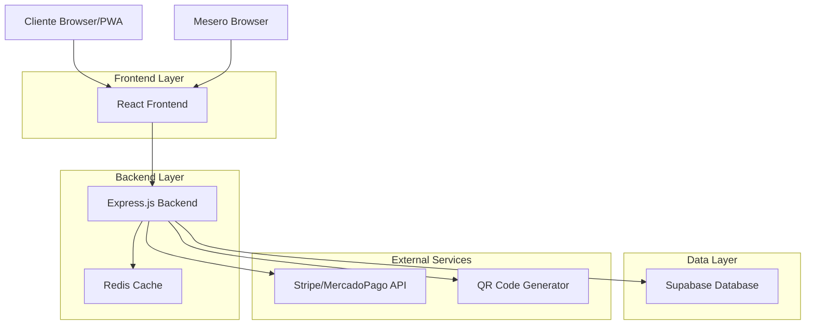
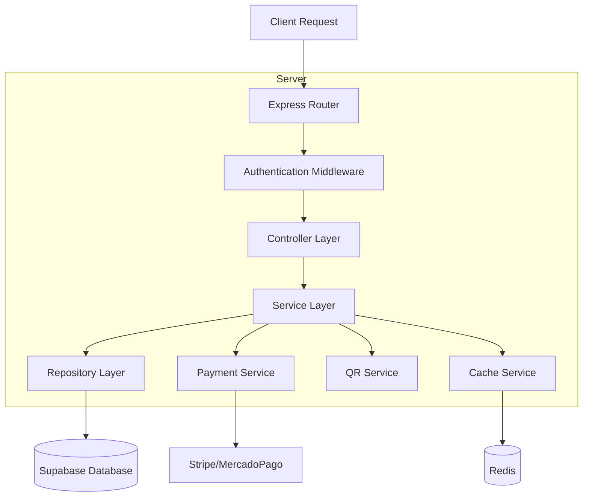
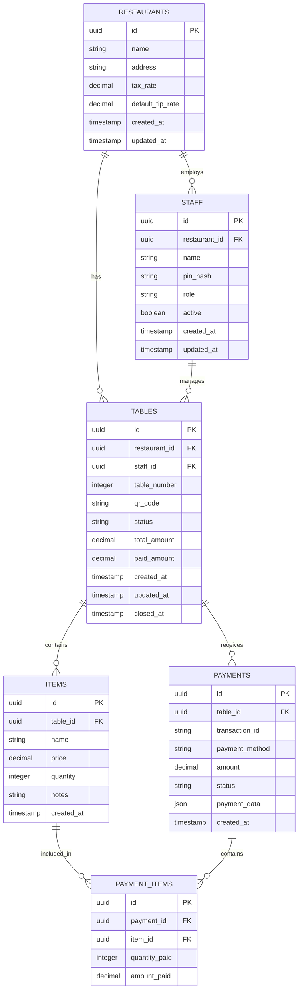

# Bouquet - Arquitectura Técnica

## 1. Architecture design



## 2. Technology Description

* **Frontend**: React\@18 + TypeScript + TailwindCSS\@3 + Vite

* **Backend**: Express.js\@4 + TypeScript + Node.js

* **Database**: Supabase (PostgreSQL)

* **Cache**: Redis

* **Payment**: Stripe + MercadoPago APIs

* **QR Generation**: qrcode library

* **Authentication**: Supabase Auth

## 3. Route definitions

| Route                 | Purpose                              |
| --------------------- | ------------------------------------ |
| /                     | Landing page y redirección           |
| /staff/login          | Login para meseros                   |
| /staff/dashboard      | Dashboard principal de mesas         |
| /staff/table/:id      | Detalle y gestión de mesa específica |
| /table/:qrId          | Vista cliente - acceso vía QR        |
| /table/:qrId/checkout | Proceso de pago del cliente          |
| /table/:qrId/receipt  | Confirmación y recibo                |
| /admin/dashboard      | Panel de administración              |
| /admin/settings       | Configuración del sistema            |

## 4. API definitions

### 4.1 Core API

**Autenticación de Staff**

```
POST /api/auth/staff/login
```

Request:

| Param Name   | Param Type | isRequired | Description        |
| ------------ | ---------- | ---------- | ------------------ |
| pin          | string     | true       | PIN del mesero     |
| restaurantId | string     | true       | ID del restaurante |

Response:

| Param Name | Param Type | Description                |
| ---------- | ---------- | -------------------------- |
| success    | boolean    | Estado de la autenticación |
| token      | string     | JWT token para sesión      |
| user       | object     | Datos del mesero           |

**Gestión de Mesas**

```
POST /api/tables
```

Request:

| Param Name  | Param Type | isRequired | Description    |
| ----------- | ---------- | ---------- | -------------- |
| tableNumber | number     | true       | Número de mesa |
| staffId     | string     | true       | ID del mesero  |

Response:

| Param Name | Param Type | Description                 |
| ---------- | ---------- | --------------------------- |
| tableId    | string     | ID único de la mesa         |
| qrCode     | string     | Código QR generado          |
| qrUrl      | string     | URL para acceso del cliente |

**Gestión de Ítems**

```
POST /api/tables/:tableId/items
```

Request:

| Param Name | Param Type | isRequired | Description       |
| ---------- | ---------- | ---------- | ----------------- |
| name       | string     | true       | Nombre del ítem   |
| price      | number     | true       | Precio unitario   |
| quantity   | number     | true       | Cantidad          |
| notes      | string     | false      | Notas adicionales |

**Proceso de Pago**

```
POST /api/payments/process
```

Request:

| Param Name    | Param Type | isRequired | Description                        |
| ------------- | ---------- | ---------- | ---------------------------------- |
| tableId       | string     | true       | ID de la mesa                      |
| selectedItems | array      | true       | Ítems seleccionados por el cliente |
| paymentMethod | string     | true       | stripe o mercadopago               |
| paymentData   | object     | true       | Datos de la tarjeta                |

Response:

| Param Name    | Param Type | Description          |
| ------------- | ---------- | -------------------- |
| success       | boolean    | Estado del pago      |
| transactionId | string     | ID de la transacción |
| receipt       | object     | Datos del recibo     |

## 5. Server architecture diagram



## 6. Data model

### 6.1 Data model definition



### 6.2 Data Definition Language

**Restaurants Table**

```sql
CREATE TABLE restaurants (
    id UUID PRIMARY KEY DEFAULT gen_random_uuid(),
    name VARCHAR(255) NOT NULL,
    address TEXT,
    tax_rate DECIMAL(5,4) DEFAULT 0.16,
    default_tip_rate DECIMAL(5,4) DEFAULT 0.10,
    created_at TIMESTAMP WITH TIME ZONE DEFAULT NOW(),
    updated_at TIMESTAMP WITH TIME ZONE DEFAULT NOW()
);

GRANT SELECT ON restaurants TO anon;
GRANT ALL PRIVILEGES ON restaurants TO authenticated;
```

**Staff Table**

```sql
CREATE TABLE staff (
    id UUID PRIMARY KEY DEFAULT gen_random_uuid(),
    restaurant_id UUID REFERENCES restaurants(id),
    name VARCHAR(255) NOT NULL,
    pin_hash VARCHAR(255) NOT NULL,
    role VARCHAR(50) DEFAULT 'waiter',
    active BOOLEAN DEFAULT true,
    created_at TIMESTAMP WITH TIME ZONE DEFAULT NOW(),
    updated_at TIMESTAMP WITH TIME ZONE DEFAULT NOW()
);

CREATE INDEX idx_staff_restaurant_id ON staff(restaurant_id);
CREATE INDEX idx_staff_pin ON staff(pin_hash);

GRANT SELECT ON staff TO anon;
GRANT ALL PRIVILEGES ON staff TO authenticated;
```

**Tables Table**

```sql
CREATE TABLE tables (
    id UUID PRIMARY KEY DEFAULT gen_random_uuid(),
    restaurant_id UUID REFERENCES restaurants(id),
    staff_id UUID REFERENCES staff(id),
    table_number INTEGER NOT NULL,
    qr_code VARCHAR(255) UNIQUE NOT NULL,
    status VARCHAR(50) DEFAULT 'active' CHECK (status IN ('active', 'closed')),
    total_amount DECIMAL(10,2) DEFAULT 0,
    paid_amount DECIMAL(10,2) DEFAULT 0,
    created_at TIMESTAMP WITH TIME ZONE DEFAULT NOW(),
    updated_at TIMESTAMP WITH TIME ZONE DEFAULT NOW(),
    closed_at TIMESTAMP WITH TIME ZONE
);

CREATE INDEX idx_tables_restaurant_id ON tables(restaurant_id);
CREATE INDEX idx_tables_qr_code ON tables(qr_code);
CREATE INDEX idx_tables_status ON tables(status);

GRANT SELECT ON tables TO anon;
GRANT ALL PRIVILEGES ON tables TO authenticated;
```

**Items Table**

```sql
CREATE TABLE items (
    id UUID PRIMARY KEY DEFAULT gen_random_uuid(),
    table_id UUID REFERENCES tables(id),
    name VARCHAR(255) NOT NULL,
    price DECIMAL(10,2) NOT NULL,
    quantity INTEGER NOT NULL DEFAULT 1,
    notes TEXT,
    created_at TIMESTAMP WITH TIME ZONE DEFAULT NOW()
);

CREATE INDEX idx_items_table_id ON items(table_id);

GRANT SELECT ON items TO anon;
GRANT ALL PRIVILEGES ON items TO authenticated;
```

**Payments Table**

```sql
CREATE TABLE payments (
    id UUID PRIMARY KEY DEFAULT gen_random_uuid(),
    table_id UUID REFERENCES tables(id),
    transaction_id VARCHAR(255) UNIQUE NOT NULL,
    payment_method VARCHAR(50) NOT NULL,
    amount DECIMAL(10,2) NOT NULL,
    status VARCHAR(50) DEFAULT 'pending' CHECK (status IN ('pending', 'completed', 'failed')),
    payment_data JSONB,
    created_at TIMESTAMP WITH TIME ZONE DEFAULT NOW()
);

CREATE INDEX idx_payments_table_id ON payments(table_id);
CREATE INDEX idx_payments_transaction_id ON payments(transaction_id);
CREATE INDEX idx_payments_status ON payments(status);

GRANT SELECT ON payments TO anon;
GRANT ALL PRIVILEGES ON payments TO authenticated;
```

**Payment Items Table**

```sql
CREATE TABLE payment_items (
    id UUID PRIMARY KEY DEFAULT gen_random_uuid(),
    payment_id UUID REFERENCES payments(id),
    item_id UUID REFERENCES items(id),
    quantity_paid INTEGER NOT NULL,
    amount_paid DECIMAL(10,2) NOT NULL
);

CREATE INDEX idx_payment_items_payment_id ON payment_items(payment_id);
CREATE INDEX idx_payment_items_item_id ON payment_items(item_id);

GRANT SELECT ON payment_items TO anon;
GRANT ALL PRIVILEGES ON payment_items TO authenticated;
```

**Initial Data**

```sql
-- Restaurante de ejemplo
INSERT INTO restaurants (name, address, tax_rate, default_tip_rate) 
VALUES ('Restaurante Demo', 'Calle Principal 123', 0.16, 0.10);

-- Staff de ejemplo
INSERT INTO staff (restaurant_id, name, pin_hash, role) 
VALUES (
    (SELECT id FROM restaurants WHERE name = 'Restaurante Demo'),
    'Mesero Demo',
    '$2b$10$example_hashed_pin',
    'waiter'
);
```

