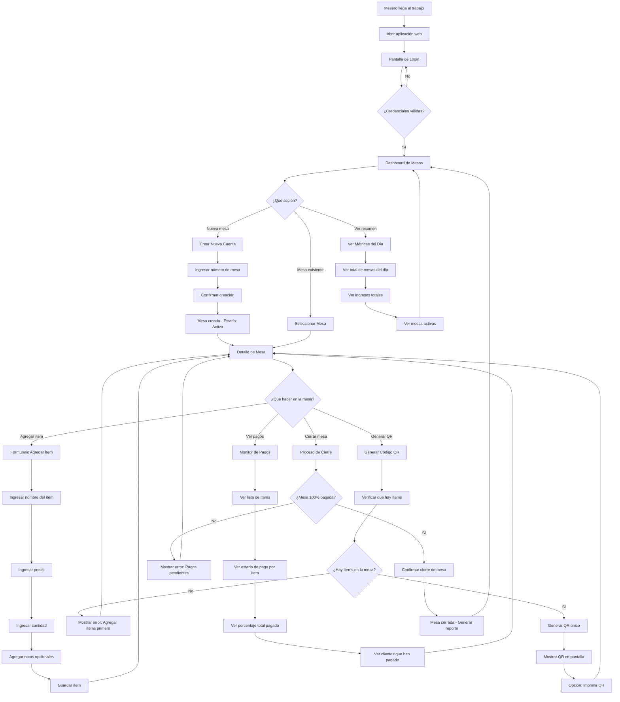
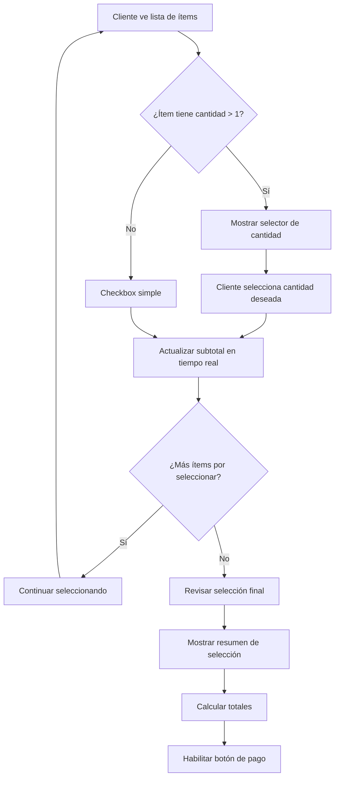
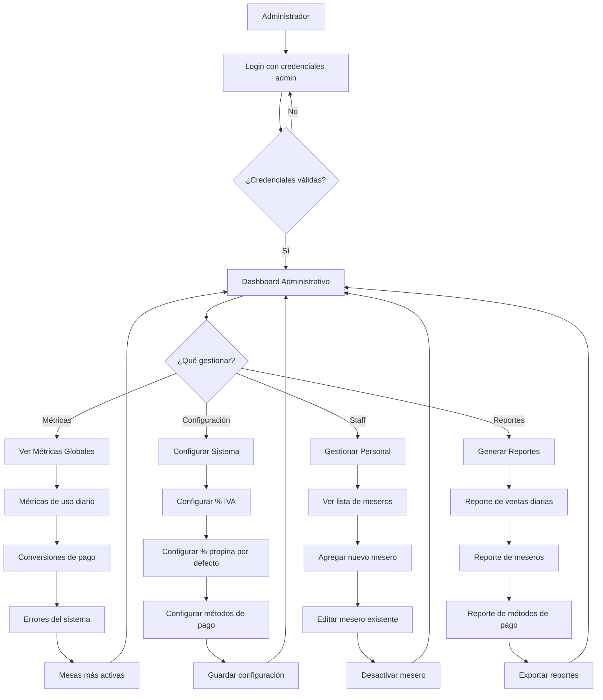
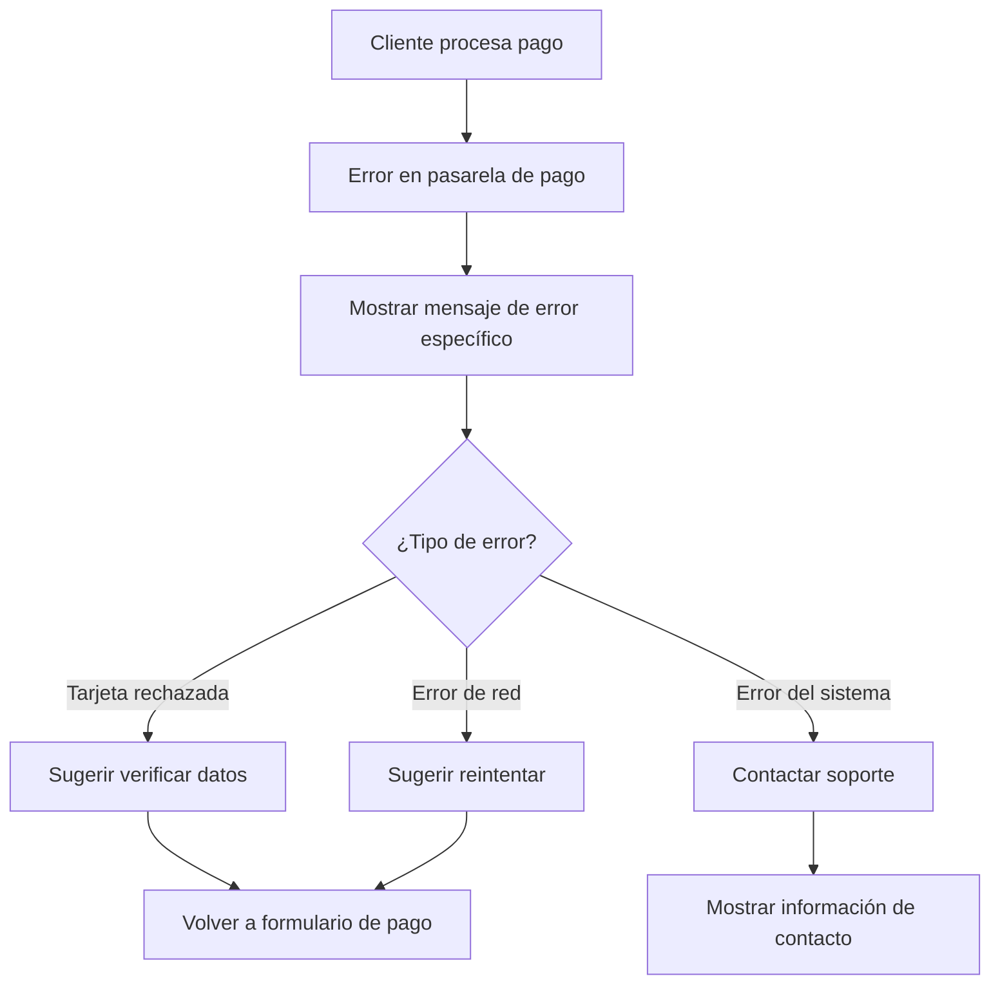
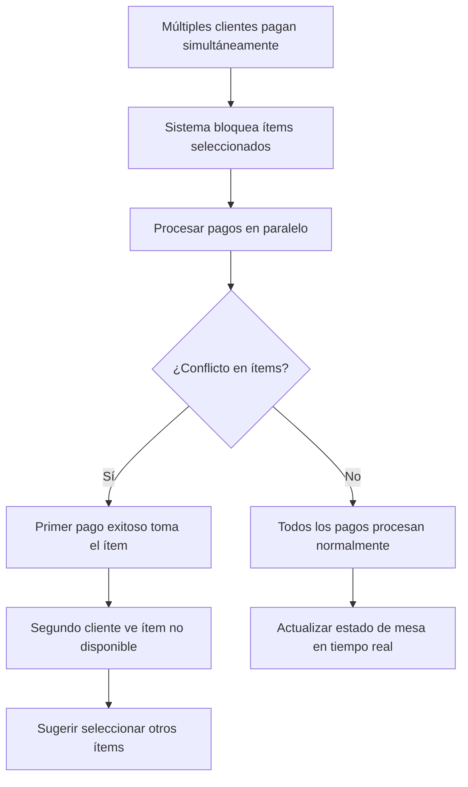
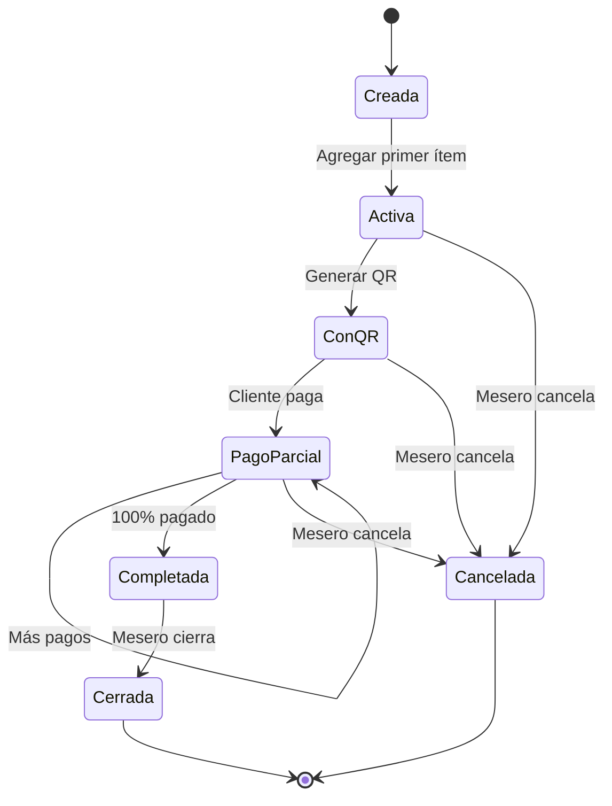
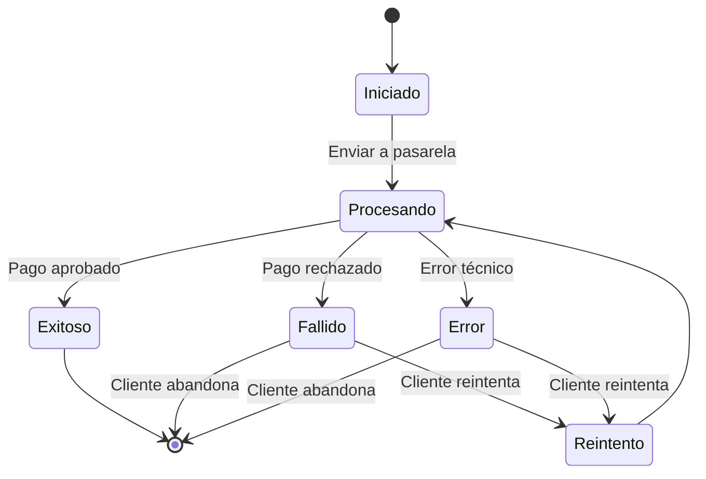
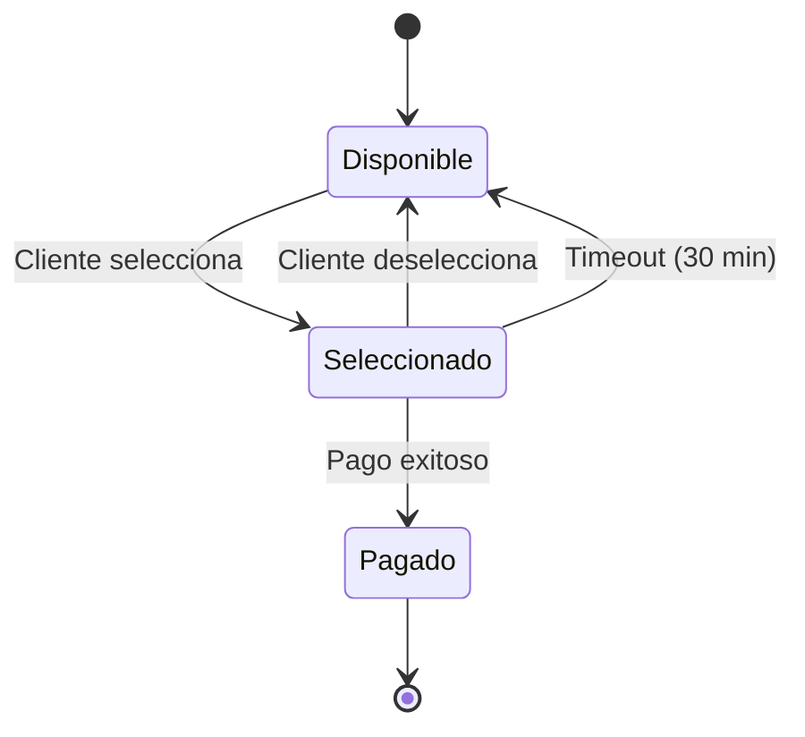

# Bouquet - Flujos de Usuario

## 📋 Tabla de Contenidos

1. [Flujo del Mesero](#flujo-del-mesero)
2. [Flujo del Cliente](#flujo-del-cliente)
3. [Flujo del Administrador](#flujo-del-administrador)
4. [Casos de Uso Especiales](#casos-de-uso-especiales)
5. [Estados del Sistema](#estados-del-sistema)

## 👨‍🍳 Flujo del Mesero

### Diagrama Principal - Gestión de Mesa



### Subproceso: Gestión de Ítems

```mermaid
flowchart TD
    A[Mesero en Detalle de Mesa] --> B[Click "Agregar Ítem"]
    B --> C[Formulario de Ítem]
    C --> D[Ingresar nombre]
    D --> E[Ingresar precio]
    E --> F[Seleccionar cantidad]
    F --> G{¿Agregar notas?}
    G -->|Sí| H[Escribir notas especiales]
    G -->|No| I[Guardar ítem]
    H --> I
    I --> J{¿Ítem guardado exitosamente?}
    J -->|Sí| K[Actualizar lista de ítems]
    J -->|No| L[Mostrar error]
    K --> M[Recalcular total de mesa]
    M --> N[Volver a Detalle de Mesa]
    L --> C
    
    N --> O{¿Agregar más ítems?}
    O -->|Sí| B
    O -->|No| P[Continuar con otras acciones]
```

## 📱 Flujo del Cliente

### Diagrama Principal - Experiencia del Comensal

```mermaid
flowchart TD
    A[Cliente en restaurante] --> B[Mesero muestra QR de mesa]
    B --> C[Cliente escanea QR con cámara]
    C --> D{¿QR válido?}
    D -->|No| E[Error: QR inválido o expirado]
    D -->|Sí| F[Cargar PWA en móvil]
    
    F --> G[Pantalla de Bienvenida]
    G --> H[Mostrar logo del restaurante]
    H --> I[Mostrar número de mesa]
    I --> J[Botón "Ver Mi Cuenta"]
    J --> K[Cargar cuenta de la mesa]
    
    K --> L{¿Hay ítems en la mesa?}
    L -->|No| M[Mensaje: La mesa aún no tiene ítems]
    L -->|Sí| N[Lista de ítems con checkboxes]
    
    N --> O[Cliente revisa lista completa]
    O --> P[Cliente selecciona sus ítems]
    P --> Q{¿Seleccionó al menos un ítem?}
    Q -->|No| R[Mensaje: Debe seleccionar al menos un ítem]
    Q -->|Sí| S[Calcular subtotal de ítems seleccionados]
    
    S --> T[Calcular IVA]
    T --> U[Calcular propina sugerida]
    U --> V[Mostrar desglose en barra inferior]
    V --> W[Botón "Proceder al Pago"]
    W --> X[Pantalla de Checkout]
    
    X --> Y[Resumen final de pago]
    Y --> Z[Seleccionar método de pago]
    Z --> AA{¿Qué método?}
    AA -->|Stripe| BB[Formulario de tarjeta Stripe]
    AA -->|MercadoPago| CC[Formulario MercadoPago]
    
    BB --> DD[Ingresar datos de tarjeta]
    CC --> DD
    DD --> EE[Validar datos]
    EE --> FF{¿Datos válidos?}
    FF -->|No| GG[Mostrar errores de validación]
    FF -->|Sí| HH[Procesar pago]
    
    GG --> DD
    HH --> II{¿Pago exitoso?}
    II -->|No| JJ[Mostrar error de pago]
    II -->|Sí| KK[Pantalla de confirmación]
    
    KK --> LL[Mostrar recibo digital]
    LL --> MM[Mostrar número de transacción]
    MM --> NN[Opción: Enviar recibo por email]
    NN --> OO[Mensaje: Gracias por su pago]
    OO --> PP[Opción: Volver a la cuenta]
    
    JJ --> X
    R --> P
    M --> QQ[Botón "Actualizar"]
    QQ --> K
    E --> RR[Contactar al mesero]
```

### Subproceso: Selección de Ítems



## 👨‍💼 Flujo del Administrador

### Diagrama de Administración



## 🔄 Casos de Uso Especiales

### Caso 1: Cliente abandona el pago

```mermaid
flowchart TD
    A[Cliente en proceso de pago] --> B[Cliente cierra aplicación]
    B --> C[Pago queda en estado "pendiente"]
    C --> D[Sistema mantiene selección por 30 min]
    D --> E{¿Cliente regresa?}
    E -->|Sí| F[Restaurar selección]
    E -->|No| G[Liberar ítems seleccionados]
    F --> H[Continuar con pago]
    G --> I[Ítems disponibles para otros]
```

### Caso 2: Error en el pago



### Caso 3: Mesa con múltiples pagos simultáneos



## 📊 Estados del Sistema

### Estados de Mesa



### Estados de Pago



### Estados de Ítem



***

## 📝 Notas Importantes

1. **Tiempo de sesión**: Las selecciones de clientes expiran en 30 minutos
2. **Concurrencia**: El sistema maneja múltiples clientes pagando simultáneamente
3. **Recuperación**: Los meseros pueden ver el estado en tiempo real
4. **Notificaciones**: El sistema notifica cambios de estado automáticamente
5. **Backup**: Todos los estados se persisten en la base de datos

## 🔧 Consideraciones Técnicas

* **WebSockets**: Para actualizaciones en tiempo real

* **Estado local**: Mantener estado en localStorage para recuperación

* **Retry logic**: Reintentos automáticos para operaciones críticas

* **Logging**: Registrar todos los cambios de estado para auditoría

