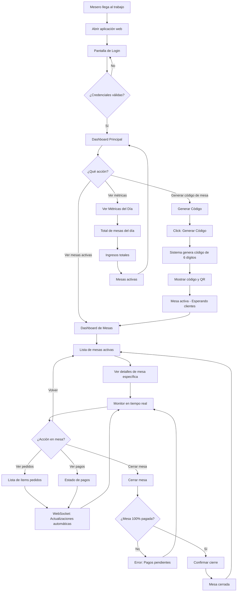
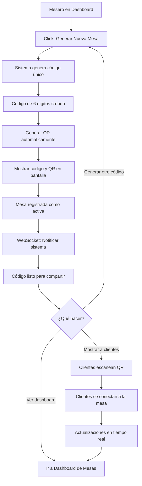
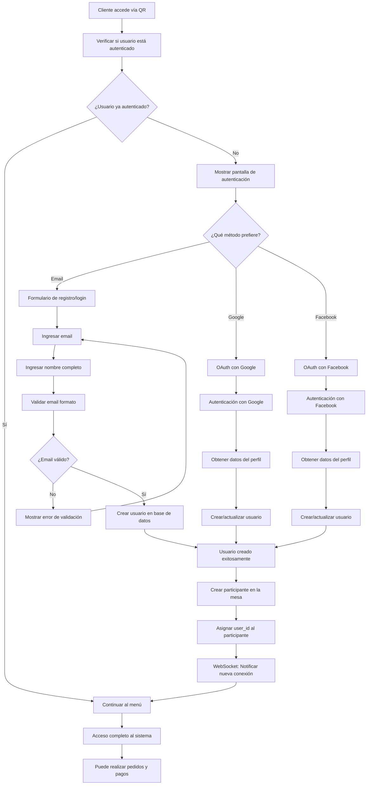
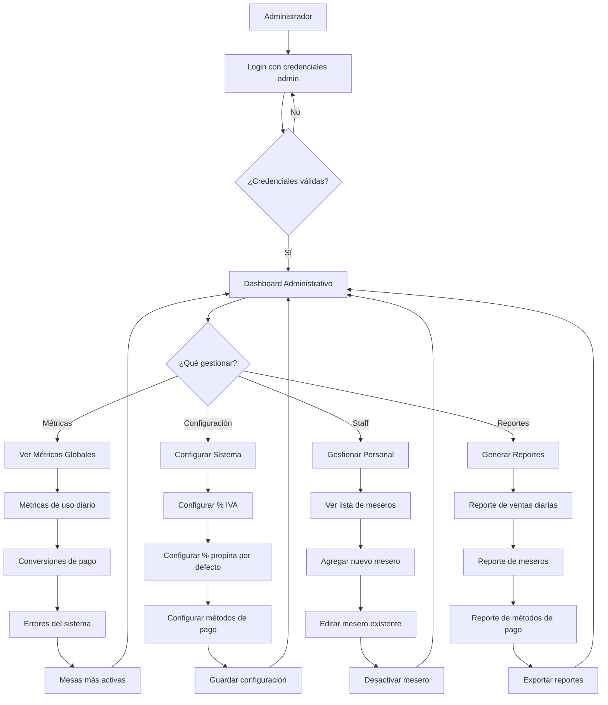
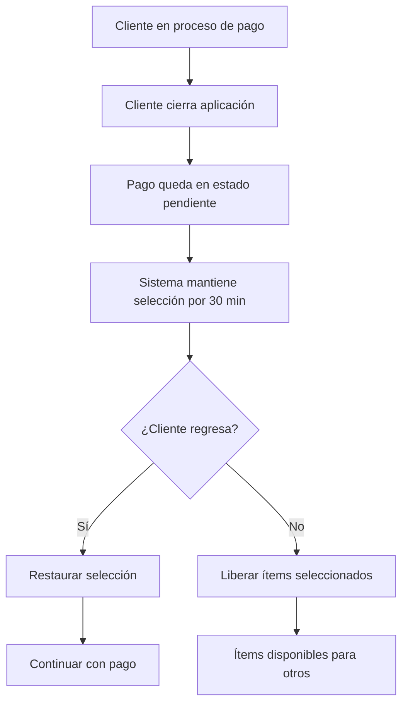
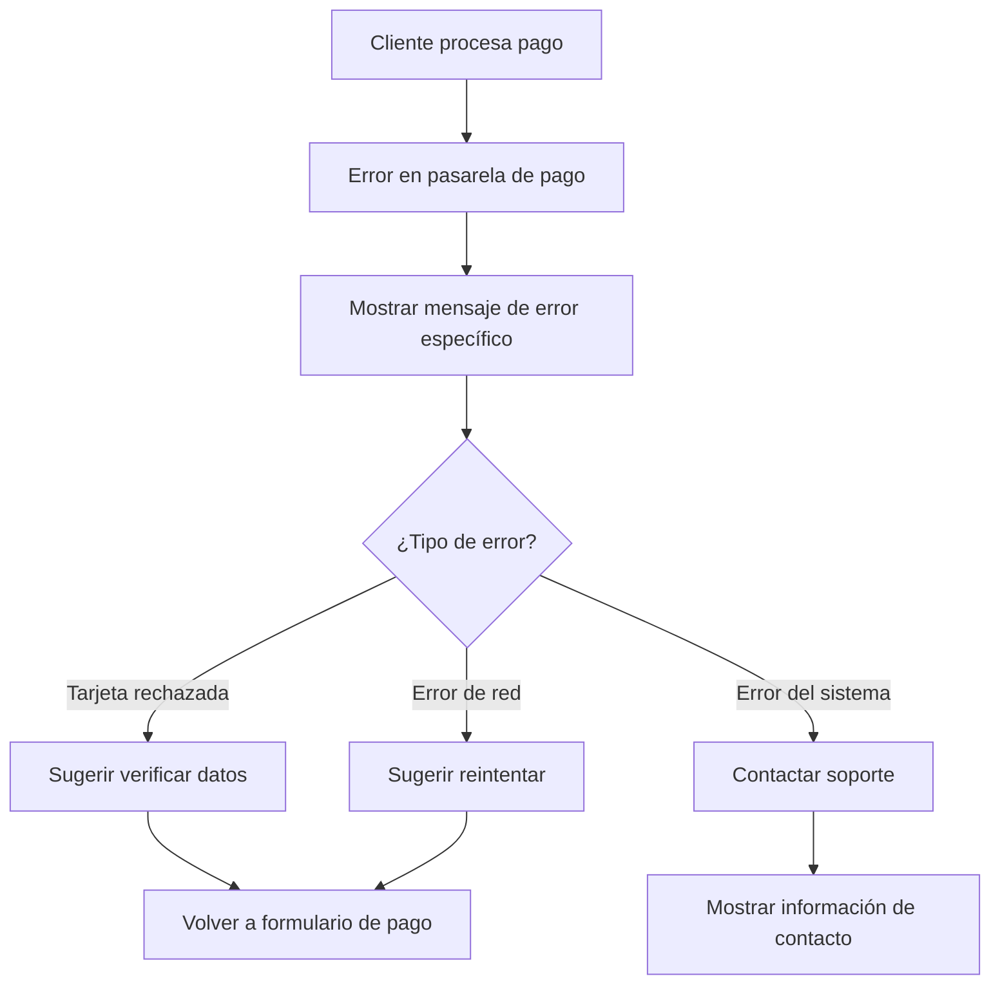
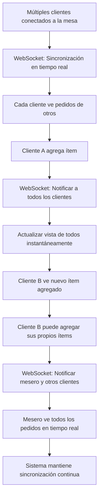
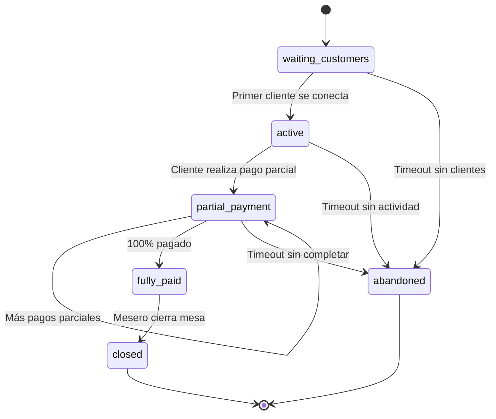
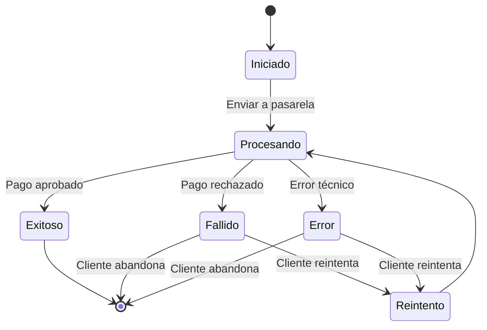
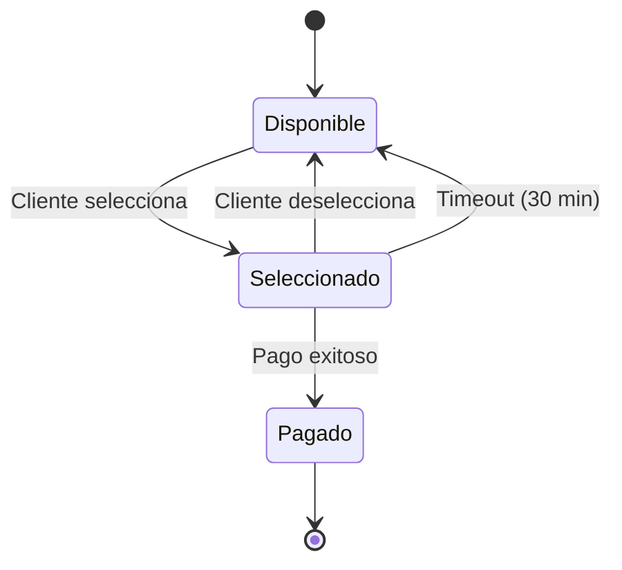

# Bouquet - Flujos de Usuario

## 📋 Tabla de Contenidos

1. [Flujo del Mesero](#flujo-del-mesero)
2. [Flujo del Cliente](#flujo-del-cliente)
3. [Flujo del Administrador](#flujo-del-administrador)
4. [Casos de Uso Especiales](#casos-de-uso-especiales)
5. [Estados del Sistema](#estados-del-sistema)

## 👨‍🍳 Flujo del Mesero

### Diagrama Principal - Flujo Simplificado



### Subproceso: Generación de Código de Mesa



## 📱 Flujo del Cliente

### Diagrama Principal - Experiencia del Cliente

```mermaid
flowchart TD
    A[Cliente en restaurante] --> B[Mesero muestra QR de mesa]
    B --> C[Cliente escanea QR con cámara]
    C --> D{¿QR válido?}
    D -->|No| E[Error: QR inválido o expirado]
    D -->|Sí| F[Cargar PWA en móvil]
    
    F --> G[Pantalla de Bienvenida]
    G --> H[Mostrar información del restaurante]
    H --> I[Mostrar código de mesa]
    I --> J[Solicitar autenticación del usuario]
    J --> K{¿Usuario autenticado?}
    K -->|No| L[Registro/Login obligatorio]
    K -->|Sí| M[Acceder al menú digital]
    L --> L1[Ingresar email y nombre]
    L1 --> L2[Verificar email (opcional)]
    L2 --> M
    
    M --> N[WebSocket: Conectar a mesa como participante]
    N --> O[Cargar menú del restaurante por categorías]
    O --> P[Explorar categorías disponibles]
    P --> Q[Seleccionar ítem del menú base]
    Q --> R{¿Ítem tiene modificadores?}
    R -->|Sí| S[Mostrar grupos de modificadores]
    R -->|No| W[Especificar cantidad]
    
    S --> T[Seleccionar modificadores obligatorios]
    T --> U[Seleccionar modificadores opcionales]
    U --> V[Calcular precio con modificadores]
    V --> W
    
    W --> X[Agregar al carrito personal]
    X --> Y[WebSocket: Notificar al mesero y otros participantes]
    
    Y --> Z{¿Continuar pidiendo?}
    Z -->|Sí| P
    Z -->|No| AA[Revisar carrito completo]
    
    AA --> BB[Calcular subtotal con modificadores]
    BB --> CC[Calcular IVA]
    CC --> DD[Calcular propina sugerida]
    DD --> EE[Mostrar desglose total]
    EE --> FF[Botón: Proceder al Pago]
    FF --> GG[Pantalla de Checkout]
    
    Y --> Z[Resumen final de pago]
    Z --> AA[Seleccionar método de pago]
    AA --> BB{¿Qué método?}
    BB -->|Stripe| CC[Formulario de tarjeta Stripe]
    BB -->|MercadoPago| DD[Formulario MercadoPago]
    
    CC --> EE[Ingresar datos de tarjeta]
    DD --> EE
    EE --> FF[Validar datos]
    FF --> GG{¿Datos válidos?}
    GG -->|No| HH[Mostrar errores de validación]
    GG -->|Sí| II[Procesar pago]
    
    HH --> EE
    II --> JJ{¿Pago exitoso?}
    JJ -->|No| KK[Mostrar error de pago]
    JJ -->|Sí| LL[WebSocket: Notificar pago exitoso]
    
    LL --> MM[Pantalla de confirmación]
    MM --> NN[Mostrar recibo digital]
    NN --> OO[Mostrar número de transacción]
    OO --> PP[Opción: Enviar recibo por email]
    PP --> QQ[Mensaje: Gracias por su pago]
    QQ --> RR[Opción: Continuar en la mesa]
    
    KK --> Y
    E --> SS[Contactar al mesero]
    RR --> TT[Seguir conectado para más pedidos]
    TT --> M
```

### Subproceso: Selección de Ítems del Cliente con Modificadores

```mermaid
flowchart TD
    A[Cliente autenticado ve menú] --> B[Explorar categorías del menú]
    B --> C[Seleccionar categoría específica]
    C --> D[Ver ítems base de la categoría]
    D --> E[Seleccionar ítem base del menú]
    
    E --> F{¿Ítem tiene grupos de modificadores?}
    F -->|No| M[Especificar cantidad]
    F -->|Sí| G[Cargar grupos de modificadores]
    
    G --> H[Mostrar modificadores obligatorios]
    H --> I[Seleccionar opciones obligatorias]
    I --> J{¿Hay modificadores opcionales?}
    J -->|Sí| K[Mostrar modificadores opcionales]
    J -->|No| L[Calcular precio final]
    
    K --> K1[Seleccionar modificadores deseados]
    K1 --> L
    
    L --> L1[Precio base + ajustes de modificadores]
    L1 --> M
    
    M --> N[Agregar notas especiales (opcional)]
    N --> O[Confirmar selección]
    O --> P[Guardar en TAB_ITEMS con JSON de modificadores]
    P --> Q[WebSocket: Notificar mesero y participantes]
    Q --> R[Actualizar total de mesa en tiempo real]
    R --> S{¿Continuar pidiendo?}
    S -->|Sí| A
    S -->|No| T[Revisar carrito completo]
    
    T --> U[Ver resumen con modificadores]
    U --> V[Calcular subtotal + IVA + propina]
    V --> W[Habilitar botón de pago]
    W --> X[Proceder al checkout]
```

### Subproceso: Autenticación Obligatoria de Usuario



## 👨‍💼 Flujo del Administrador

### Diagrama de Administración



## 🔄 Casos de Uso Especiales

### Caso 1: Cliente abandona el pago



### Caso 2: Error en el pago



### Caso 3: Mesa con múltiples clientes conectados



## 📊 Estados del Sistema

### Estados de Mesa



### Estados de Pago



### Estados de Ítem



***

## 📝 Notas Importantes

1. **Flujo Simplificado**: El mesero usa códigos de staff temporales para generar mesas, los clientes eligen sus propios ítems del menú estructurado
2. **Autenticación Obligatoria**: Todos los usuarios deben autenticarse antes de realizar pedidos o pagos
3. **Sistema de Menú Completo**: Categorías, ítems base, modificadores y cálculos automáticos de precios
4. **Modificadores Flexibles**: Soporte para modificadores obligatorios y opcionales con ajustes de precio
5. **Estados de Mesa Granulares**: 6 estados (waiting_customers, active, partial_payment, fully_paid, closed, abandoned)
6. **Tiempo Real**: WebSockets mantienen sincronización instantánea entre todos los dispositivos
7. **Concurrencia**: Múltiples clientes autenticados pueden conectarse y pedir simultáneamente
8. **Persistencia**: Todos los pedidos, modificadores y pagos se guardan automáticamente en Supabase
9. **Recuperación**: El sistema mantiene el estado incluso si se pierde la conexión
10. **Notificaciones**: Actualizaciones automáticas para meseros y clientes
11. **Trazabilidad**: Cada pedido está vinculado a un usuario específico para auditoría completa
12. **Validaciones Automáticas**: Constraints de base de datos para integridad de precios y cálculos

## 🔧 Consideraciones Técnicas

* **WebSockets (Supabase Realtime)**: Sincronización instantánea de pedidos, pagos y estado de mesa

* **Base de Datos**: Supabase PostgreSQL con Row Level Security (RLS) para seguridad

* **Estado Reactivo**: Zustand para manejo de estado local con persistencia

* **PWA**: Aplicación web progresiva para experiencia nativa en móviles

* **Códigos QR**: Generación automática de códigos únicos de 6 dígitos

* **Pagos**: Integración con Stripe y MercadoPago para procesamiento seguro

* **Retry Logic**: Reintentos automáticos para operaciones críticas de red

* **Logging**: Auditoría completa de todas las transacciones y cambios de estado

