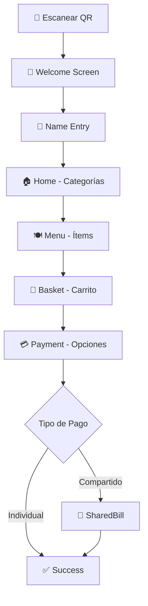
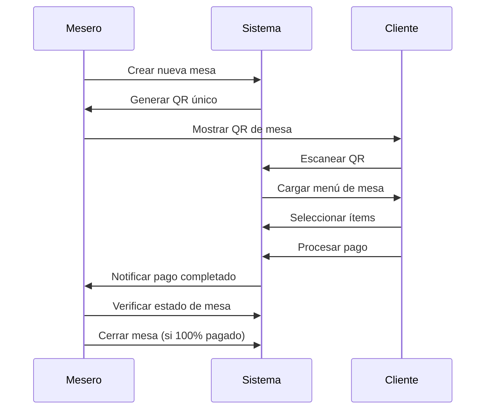
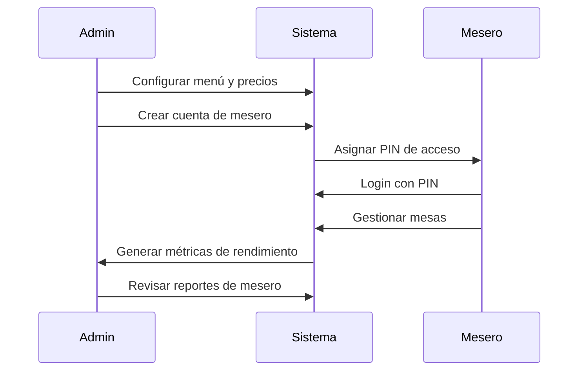

# Bouquet - Guía de Interfaces de Usuario

## 📋 Tabla de Contenidos

1. [Vista de Usuario (Cliente/Comensal)](#-1-vista-de-usuario-clientecomensal)
2. [Vista de Mesero (Staff)](#-2-vista-de-mesero-staff)
3. [Vista de Administrador](#-3-vista-de-administrador)
4. [Interacciones Entre Roles](#-interacciones-clave-entre-roles)
5. [Seguridad y Permisos](#-seguridad-y-permisos)

---

## 🧑‍🤝‍🧑 1. Vista de Usuario (Cliente/Comensal)

### 📱 Acceso y Autenticación

| Característica | Descripción |
|----------------|-------------|
| **Método de acceso** | Escaneo de código QR de la mesa |
| **Registro requerido** | ❌ No requiere registro previo |
| **Datos mínimos** | Solo nombre y opcionalmente email/teléfono |
| **URL única** | Cada mesa tiene URL única (ej: `/table/abc123`) |
| **Persistencia** | Sesión se mantiene durante la comida |

### 🔄 Flujo de Navegación Completo



#### Detalle de Cada Pantalla:

1. **🌟 Welcome Screen**
   - Pantalla de bienvenida con animación elegante
   - Logo del restaurante Bouquet
   - Transición suave hacia captura de datos

2. **👤 Name Entry**
   - Formulario simple para capturar nombre
   - Validación en tiempo real
   - Imagen decorativa (rosa elegante)
   - Botón de continuar habilitado solo con nombre válido

3. **🏠 Home - Categorías**
   - Grid de categorías con imágenes:
     - 🥤 Bebidas
     - 🥞 Desayunos
     - 🥗 Aperitivos
     - 🍽️ Platos Principales
     - 🍰 Postres
   - Contador de carrito en header
   - Navegación intuitiva

4. **🍽️ Menu - Ítems por Categoría**
   - Lista de productos con:
     - Nombre y descripción
     - Precio claramente visible
     - Botón "Agregar" por ítem
   - Navegación de regreso a categorías
   - Actualización de contador de carrito

5. **🛒 Basket - Gestión de Carrito**
   - Lista de ítems seleccionados
   - Controles de cantidad (+/-)
   - Subtotal por ítem
   - Total general
   - Opciones:
     - Continuar comprando
     - Proceder al pago

6. **💳 Payment - Opciones de Pago**
   - Selección de método:
     - 👤 Pago Individual (pago completo)
     - 👥 Factura Compartida (dividir cuenta)
   - Resumen de total a pagar
   - Botones de acción según selección

7. **🧾 SharedBill - División de Cuenta**
   - Lista de todos los ítems de la mesa
   - Checkboxes para seleccionar ítems propios
   - Opción de monto personalizado
   - Cálculo automático de:
     - Subtotal de ítems seleccionados
     - Total a pagar
     - Restante de la cuenta

8. **✅ Success - Confirmación**
   - Confirmación de pago exitoso
   - Recibo digital
   - Número de transacción
   - Opción de envío por email

### 🔑 Permisos y Funcionalidades del Cliente

| Acción | Permitido | Descripción |
|--------|-----------|-------------|
| Ver menú completo | ✅ | Acceso a todos los ítems de la mesa |
| Agregar ítems al carrito | ✅ | Gestión de carrito personal |
| Modificar cantidades | ✅ | Control total del carrito propio |
| Ver ítems de otros | ✅ | Visibilidad de toda la cuenta |
| Seleccionar ítems propios | ✅ | Para pago individual |
| Procesar pago | ✅ | Pago con tarjeta integrado |
| Participar en división | ✅ | Selección de ítems para dividir |
| Modificar ítems ajenos | ❌ | No puede cambiar selecciones de otros |
| Cerrar mesa | ❌ | Solo el mesero puede cerrar |
| Ver datos de pago ajenos | ❌ | Privacidad de transacciones |

### 📱 Características PWA (Progressive Web App)

- **🔧 Instalable**: Se puede instalar como app nativa en el dispositivo
- **📶 Offline**: Funciona sin conexión para revisar cuenta
- **📱 Responsive**: Diseño optimizado para móviles
- **🔔 Notificaciones**: Alertas de cambios en la cuenta
- **⚡ Rápida**: Carga instantánea y navegación fluida
- **🔒 Segura**: HTTPS y datos encriptados

---

## 👨‍🍳 2. Vista de Mesero (Staff)

### 🔐 Autenticación del Mesero

| Método | Detalles |
|--------|----------|
| **Tipo de login** | PIN de 4-6 dígitos |
| **Sesión** | Persistente durante turno de trabajo |
| **Identificación** | ID único por mesero |
| **Seguridad** | PIN hasheado en base de datos |
| **Recuperación** | Solo administrador puede resetear |

### 🏠 Dashboard Principal

#### Vista de Mesas
```
┌─────────────────────────────────────┐
│           Dashboard Mesas           │
├─────────────────────────────────────┤
│  🟢 Mesa 1    🟡 Mesa 2    🔴 Mesa 3 │
│   Libre      Ocupada    Pendiente   │
│                                     │
│  ✅ Mesa 4    🟢 Mesa 5    🟡 Mesa 6 │
│  Completa     Libre      Ocupada    │
└─────────────────────────────────────┘
```

#### Indicadores Visuales
| Estado | Color | Descripción |
|--------|-------|-------------|
| 🟢 Libre | Verde | Mesa disponible para nuevos clientes |
| 🟡 Ocupada | Amarillo | Mesa con clientes, cuenta activa |
| 🔴 Pendiente | Rojo | Cuenta con pagos pendientes |
| ✅ Completa | Verde con check | Mesa lista para cerrar (100% pagada) |

### 📋 Gestión Completa de Mesas

#### 1. 🆕 Crear Nueva Cuenta
```
Formulario de Nueva Mesa:
┌─────────────────────────┐
│ Número de Mesa: [  5  ] │
│ Mesero: Juan Pérez      │
│ Fecha: 2024-01-20       │
│ Hora: 14:30             │
│                         │
│    [Crear Mesa]         │
└─────────────────────────┘
```

#### 2. ➕ Agregar Ítems
```
Formulario de Ítem:
┌─────────────────────────────┐
│ Nombre: [Salmón Grillado  ] │
│ Precio: [$32.00          ] │
│ Cantidad: [2             ] │
│ Notas: [Sin sal          ] │
│                             │
│ Categoría: [Platos ▼]       │
│                             │
│    [Agregar Ítem]           │
└─────────────────────────────┘
```

#### 3. 📱 Generar Código QR
- **Generación automática**: QR único por mesa
- **Opciones de visualización**:
  - Mostrar en pantalla
  - Imprimir en papel
  - Enviar por WhatsApp
- **URL incluida**: Link directo para clientes
- **Validez**: Activo mientras la mesa esté abierta

#### 4. 📊 Monitoreo de Pagos en Tiempo Real
```
Estado de Pagos - Mesa 5:
┌─────────────────────────────────────┐
│ Cliente        │ Ítems │ Estado     │
├─────────────────────────────────────┤
│ Ana García     │ 3/5   │ ✅ Pagado  │
│ Luis Martín    │ 2/5   │ ⏳ Pendiente│
│ María López    │ 0/5   │ ❌ Sin pagar│
├─────────────────────────────────────┤
│ Total Mesa: $156.00                 │
│ Pagado: $89.00 (57%)                │
│ Pendiente: $67.00 (43%)             │
└─────────────────────────────────────┘
```

#### 5. ✅ Cerrar Mesa
- **Verificación automática**: 100% de pagos completados
- **Reporte final**: Resumen de la mesa
- **Liberación**: Mesa disponible para nuevo uso
- **Historial**: Registro permanente en sistema

### 🔑 Permisos del Mesero

| Funcionalidad | Acceso | Limitaciones |
|---------------|--------|-------------|
| Crear mesas | ✅ | Solo en su turno |
| Gestionar ítems | ✅ | Solo sus mesas asignadas |
| Generar QR | ✅ | Ilimitado por mesa |
| Ver pagos | ✅ | Solo sus mesas |
| Cerrar mesas | ✅ | Solo si 100% pagado |
| Ver historial | ✅ | Solo sus mesas del día |
| Acceder a otras mesas | ❌ | Restricción por mesero |
| Configurar sistema | ❌ | Solo administradores |
| Ver reportes globales | ❌ | Solo administradores |
| Gestionar personal | ❌ | Solo administradores |

### 📱 Sistema de Comunicación

#### Notificaciones Push
- **🔔 Pago completado**: Cliente terminó de pagar
- **⚠️ Error en pago**: Problema con transacción
- **📊 Mesa actualizada**: Cambios en estado de mesa
- **⏰ Recordatorios**: Mesas pendientes de cierre

#### Actualizaciones en Tiempo Real
- **WebSockets**: Conexión permanente con servidor
- **Sincronización**: Cambios instantáneos en dashboard
- **Indicadores visuales**: Cambios de color automáticos
- **Sonidos**: Alertas audibles opcionales

---

## 👨‍💼 3. Vista de Administrador

### 🔐 Autenticación Avanzada

| Característica | Detalles |
|----------------|----------|
| **Credenciales** | Usuario y contraseña segura |
| **Roles jerárquicos** | Super Admin, Manager, Supervisor |
| **Sesiones** | Timeout automático por seguridad |
| **2FA** | Autenticación de dos factores (opcional) |
| **Auditoría** | Log de todos los accesos |

### 📊 Dashboard Ejecutivo

#### Métricas en Tiempo Real
```
┌─────────────────────────────────────────────────┐
│                 Dashboard Ejecutivo              │
├─────────────────────────────────────────────────┤
│  💰 Ventas Hoy        📊 Mesas Activas          │
│     $2,450.00            8/12                   │
│                                                 │
│  🎯 Ticket Promedio   ⏱️ Tiempo Promedio        │
│     $45.30               52 min                 │
│                                                 │
│  📈 Conversión        👥 Meseros Activos        │
│     94.2%                6/8                    │
└─────────────────────────────────────────────────┘
```

#### Gráficos y KPIs
- **📈 Tendencias de ventas**: Diario, semanal, mensual
- **🏆 Productos más vendidos**: Top 10 con cantidades
- **👨‍🍳 Rendimiento por mesero**: Ventas y eficiencia
- **⏰ Horarios pico**: Análisis de flujo de clientes
- **💳 Métodos de pago**: Distribución de preferencias

### 👥 Gestión de Personal

#### Administración de Meseros
```
Lista de Personal:
┌─────────────────────────────────────────────────┐
│ Nombre         │ PIN    │ Estado   │ Acciones   │
├─────────────────────────────────────────────────┤
│ Juan Pérez     │ ****   │ ✅ Activo │ [Editar]   │
│ Ana García     │ ****   │ ✅ Activo │ [Editar]   │
│ Luis Martín    │ ****   │ ❌ Inactivo│ [Activar] │
│ María López    │ ****   │ ✅ Activo │ [Editar]   │
└─────────────────────────────────────────────────┘
```

#### Funcionalidades de Personal
- **➕ Crear cuentas**: Nuevos meseros con PIN
- **✏️ Editar información**: Datos personales y permisos
- **🔒 Gestionar accesos**: Activar/desactivar cuentas
- **📊 Ver rendimiento**: Estadísticas individuales
- **📅 Historial**: Registro de mesas atendidas

#### Control de Horarios
- **📅 Programación**: Turnos y horarios
- **⏰ Asistencia**: Control de entrada/salida
- **📈 Productividad**: Métricas por turno
- **💰 Comisiones**: Cálculo automático (si aplica)

### 🍽️ Gestión de Menú

#### Administración de Categorías
```
Categorías del Menú:
┌─────────────────────────────────────────────────┐
│ Categoría      │ Ítems │ Estado   │ Acciones   │
├─────────────────────────────────────────────────┤
│ 🥤 Bebidas      │  12   │ ✅ Activa │ [Editar]   │
│ 🥞 Desayunos    │   8   │ ✅ Activa │ [Editar]   │
│ 🥗 Aperitivos   │  15   │ ✅ Activa │ [Editar]   │
│ 🍽️ Platos       │  20   │ ✅ Activa │ [Editar]   │
│ 🍰 Postres      │  10   │ ✅ Activa │ [Editar]   │
└─────────────────────────────────────────────────┘
```

#### Gestión de Productos
- **➕ Agregar ítems**: Nuevos productos al menú
- **💰 Actualizar precios**: Cambios masivos o individuales
- **📸 Gestionar imágenes**: Subir y optimizar fotos
- **📝 Editar descripciones**: Información detallada
- **🔄 Disponibilidad**: Activar/desactivar productos
- **🏷️ Promociones**: Descuentos y ofertas especiales

### ⚙️ Configuración del Sistema

#### Parámetros Fiscales
```
Configuración Fiscal:
┌─────────────────────────────────────┐
│ IVA (%):              [16.00]       │
│ Propina sugerida (%): [10.00]       │
│ Moneda:               [MXN ▼]       │
│                                     │
│ Métodos de Pago Activos:            │
│ ☑️ Stripe                           │
│ ☑️ MercadoPago                      │
│ ☐ PayPal                            │
│ ☑️ Efectivo                         │
└─────────────────────────────────────┘
```

#### Configuración del Restaurante
- **🏢 Información básica**: Nombre, dirección, teléfono
- **🎨 Branding**: Logo, colores, tema
- **🪑 Configuración de mesas**: Números y capacidad
- **⏰ Horarios**: Apertura, cierre, días laborales
- **📧 Notificaciones**: Emails y alertas

#### Integraciones
- **💳 Pasarelas de pago**: Configuración de APIs
- **📊 Analytics**: Google Analytics, Facebook Pixel
- **📱 APIs externas**: Servicios de terceros
- **🖨️ Sistemas POS**: Integración con cajas registradoras

### 📈 Reportes Avanzados

#### Tipos de Reportes
1. **💰 Ventas Detalladas**
   - Por período (día, semana, mes, año)
   - Por mesero individual
   - Por producto o categoría
   - Comparativas históricas

2. **👥 Análisis de Clientes**
   - Patrones de consumo
   - Horarios de mayor afluencia
   - Ticket promedio por mesa
   - Tiempo de permanencia

3. **📊 Reportes Fiscales**
   - Declaraciones de impuestos
   - Facturas emitidas
   - Métodos de pago utilizados
   - Comisiones por pasarela

4. **🎯 Rendimiento Operativo**
   - Eficiencia por mesero
   - Productos más/menos vendidos
   - Horarios pico y valle
   - Rotación de mesas

#### Exportación de Datos
- **📄 PDF**: Reportes formateados para impresión
- **📊 Excel**: Datos para análisis adicional
- **📋 CSV**: Importación a otros sistemas
- **📧 Email**: Envío automático programado

### 🔑 Permisos Completos de Administrador

| Área | Permisos | Descripción |
|------|----------|-------------|
| **Mesas** | ✅ Acceso total | Ver, crear, modificar, cerrar todas las mesas |
| **Personal** | ✅ Gestión completa | Crear, editar, activar/desactivar meseros |
| **Menú** | ✅ Control total | Categorías, productos, precios, disponibilidad |
| **Configuración** | ✅ Acceso completo | Parámetros del sistema, integraciones |
| **Reportes** | ✅ Todos los reportes | Ventas, clientes, fiscal, operativo |
| **Finanzas** | ✅ Métricas completas | Ingresos, comisiones, impuestos |
| **Seguridad** | ✅ Administración | Usuarios, permisos, auditoría |
| **Backup** | ✅ Gestión de datos | Respaldo y restauración |

---

## 🔄 Interacciones Clave Entre Roles

### 👨‍🍳 Mesero ↔ 🧑‍🤝‍🧑 Cliente



#### Flujo de Comunicación
1. **📱 Mesero crea mesa** → Sistema genera QR único
2. **👥 Cliente escanea QR** → Acceso directo al menú
3. **🛒 Cliente agrega ítems** → Actualización en tiempo real
4. **💳 Cliente paga** → Notificación inmediata al mesero
5. **📊 Mesero monitorea** → Dashboard actualizado automáticamente
6. **✅ Mesa completa** → Mesero puede cerrar la cuenta

### 👨‍💼 Admin ↔ 👨‍🍳 Mesero



#### Relación Jerárquica
1. **⚙️ Admin configura sistema** → Mesero usa configuración actualizada
2. **👤 Admin crea cuentas** → Mesero recibe credenciales de acceso
3. **📊 Mesero genera ventas** → Admin ve métricas en dashboard
4. **🍽️ Admin actualiza menú** → Mesero trabaja con productos actualizados
5. **📈 Admin analiza rendimiento** → Feedback y mejoras para meseros

### 🖥️ Sistema ↔ 👥 Todos los Usuarios

#### Notificaciones Automáticas
- **🔔 Push notifications**: Cambios importantes en tiempo real
- **📧 Email alerts**: Resúmenes diarios y reportes
- **📱 SMS**: Alertas críticas (opcional)
- **🔊 Sonidos**: Notificaciones audibles en dashboard

#### Sincronización en Tiempo Real
- **⚡ WebSockets**: Conexión permanente para actualizaciones
- **🔄 Auto-refresh**: Datos siempre actualizados
- **📊 Live updates**: Métricas y estados en vivo
- **🔐 Session management**: Manejo seguro de sesiones

---

## 🛡️ Seguridad y Permisos

### 🔐 Niveles de Autenticación

| Rol | Método | Seguridad | Duración |
|-----|--------|-----------|----------|
| **Cliente** | QR + Nombre | Básica | Durante comida |
| **Mesero** | PIN 4-6 dígitos | Media | Turno completo |
| **Admin** | Usuario + Contraseña | Alta | Sesión con timeout |
| **Super Admin** | 2FA + Contraseña | Máxima | Sesión corta |

### 🔒 Autorización Granular

#### Matriz de Permisos

| Funcionalidad | Cliente | Mesero | Admin |
|---------------|---------|--------|---------|
| Ver menú propio | ✅ | ✅ | ✅ |
| Ver todas las mesas | ❌ | ⚠️ Solo asignadas | ✅ |
| Crear mesas | ❌ | ✅ | ✅ |
| Agregar ítems | ✅ Carrito | ✅ Mesa | ✅ |
| Procesar pagos | ✅ Propios | ❌ | ✅ |
| Ver reportes | ❌ | ❌ | ✅ |
| Configurar sistema | ❌ | ❌ | ✅ |
| Gestionar personal | ❌ | ❌ | ✅ |

### 📋 Auditoría Completa

#### Log de Actividades
```
Registro de Auditoría:
┌─────────────────────────────────────────────────────────┐
│ Timestamp           │ Usuario    │ Acción              │
├─────────────────────────────────────────────────────────┤
│ 2024-01-20 14:30:15 │ juan.perez │ Crear mesa #5       │
│ 2024-01-20 14:32:08 │ ana.garcia │ Pago procesado $45  │
│ 2024-01-20 14:35:22 │ admin      │ Actualizar menú     │
│ 2024-01-20 14:40:11 │ juan.perez │ Cerrar mesa #3      │
└─────────────────────────────────────────────────────────┘
```

#### Tipos de Eventos Registrados
- **🔐 Autenticación**: Login, logout, intentos fallidos
- **💰 Transacciones**: Pagos, reembolsos, errores
- **📝 Modificaciones**: Cambios en menú, precios, configuración
- **👥 Gestión de usuarios**: Creación, edición, desactivación
- **🚨 Errores**: Fallos del sistema, excepciones

### 🔒 Seguridad de Datos

#### Encriptación
- **🔐 Datos en tránsito**: HTTPS/TLS 1.3
- **💾 Datos en reposo**: AES-256
- **🔑 Contraseñas**: Bcrypt con salt
- **🎫 Tokens**: JWT con expiración

#### Protección de Privacidad
- **🛡️ GDPR compliance**: Cumplimiento de regulaciones
- **🔒 Datos mínimos**: Solo información necesaria
- **⏰ Retención limitada**: Eliminación automática
- **👤 Anonimización**: Datos no identificables

### 🚨 Gestión de Sesiones

#### Políticas de Sesión
- **⏰ Timeout automático**: Inactividad prolongada
- **🔄 Renovación**: Tokens refrescados automáticamente
- **🚪 Logout seguro**: Limpieza completa de sesión
- **📱 Multi-dispositivo**: Control de sesiones concurrentes

#### Recuperación de Acceso
- **🔑 Reset de PIN**: Solo administradores
- **📧 Recuperación de contraseña**: Email verificado
- **🔐 Bloqueo temporal**: Intentos fallidos múltiples
- **📞 Soporte**: Contacto para casos especiales

---

## 📱 Consideraciones Técnicas

### 🌐 Tecnologías Utilizadas
- **Frontend**: React + TypeScript + Tailwind CSS
- **Backend**: Express.js + Node.js
- **Base de datos**: Supabase (PostgreSQL)
- **Autenticación**: Supabase Auth
- **Pagos**: Stripe + MercadoPago
- **PWA**: Service Workers + Manifest

### 📊 Rendimiento
- **⚡ Carga rápida**: < 2 segundos primera carga
- **🔄 Actualizaciones**: Tiempo real con WebSockets
- **📱 Responsive**: Optimizado para todos los dispositivos
- **🌐 Offline**: Funcionalidad básica sin conexión

### 🔧 Mantenimiento
- **🔄 Actualizaciones**: Automáticas sin interrupción
- **📊 Monitoreo**: Métricas de rendimiento y errores
- **💾 Backup**: Respaldo automático diario
- **🛠️ Soporte**: Sistema de tickets integrado

---

*Última actualización: Enero 2024*
*Versión del documento: 1.0*